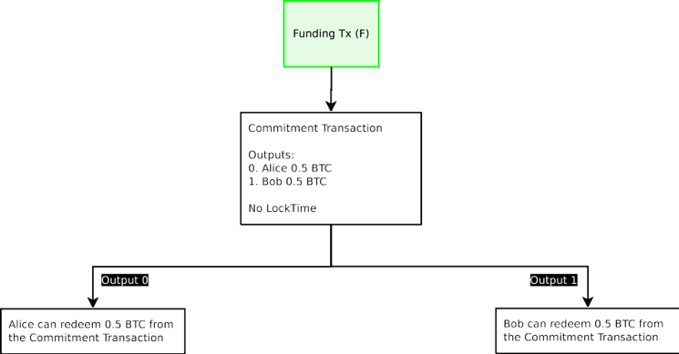
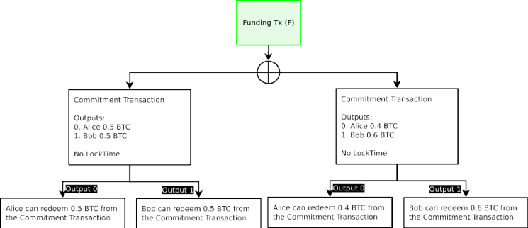
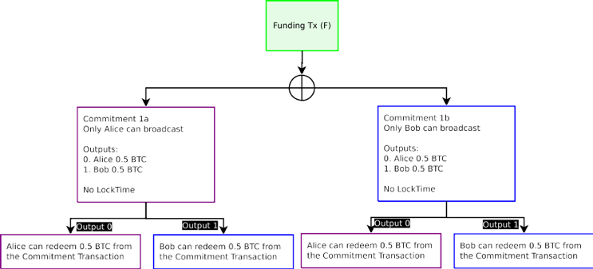

# 比特幣閃電網路：可擴展的 off-chain 即時支付
# The Bitcoin Lightning Network: Scalable Off-Chain Instant Payments

Joseph Poon  
joseph@lightning.network 

Thaddeus Dryja  
rx@awsomnet.org

二零一五年十一月二十日 草案版本 0.5.9.1

## 目錄
- [比特幣閃電網路：可擴展的 off-chain 即時支付](#%E6%AF%94%E7%89%B9%E5%B9%A3%E9%96%83%E9%9B%BB%E7%B6%B2%E8%B7%AF%E5%8F%AF%E6%93%B4%E5%B1%95%E7%9A%84-off-chain-%E5%8D%B3%E6%99%82%E6%94%AF%E4%BB%98)
- [The Bitcoin Lightning Network: Scalable Off-Chain Instant Payments](#the-bitcoin-lightning-network-scalable-off-chain-instant-payments)
  - [目錄](#%E7%9B%AE%E9%8C%84)
  - [摘要 | Abstract](#%E6%91%98%E8%A6%81--abstract)
  - [1 比特幣 Blockchain 可擴展性問題 | The Bitcoin Blockchain Scalability Problem](#1-%E6%AF%94%E7%89%B9%E5%B9%A3-blockchain-%E5%8F%AF%E6%93%B4%E5%B1%95%E6%80%A7%E5%95%8F%E9%A1%8C--the-bitcoin-blockchain-scalability-problem)
  - [2 小額支付管道可以解決可擴展性問題 | A	Network	of	Micropayment	Channels	Can Solve Scalability](#2-%E5%B0%8F%E9%A1%8D%E6%94%AF%E4%BB%98%E7%AE%A1%E9%81%93%E5%8F%AF%E4%BB%A5%E8%A7%A3%E6%B1%BA%E5%8F%AF%E6%93%B4%E5%B1%95%E6%80%A7%E5%95%8F%E9%A1%8C--a-network-of-micropayment-channels-can-solve-scalability)
    - [2.1 小額支付管道不要求信託 | Micropayment Channels Do Not Require Trust](#21-%E5%B0%8F%E9%A1%8D%E6%94%AF%E4%BB%98%E7%AE%A1%E9%81%93%E4%B8%8D%E8%A6%81%E6%B1%82%E4%BF%A1%E8%A8%97--micropayment-channels-do-not-require-trust)
    - [2.2 管道網路 | A Network of Channels](#22-%E7%AE%A1%E9%81%93%E7%B6%B2%E8%B7%AF--a-network-of-channels)
  - [3 雙向支付管道 | Bidirectional Payment Channels](#3-%E9%9B%99%E5%90%91%E6%94%AF%E4%BB%98%E7%AE%A1%E9%81%93--bidirectional-payment-channels)
    - [3.1 頻道創建中存在的問題](#31-%E9%A0%BB%E9%81%93%E5%89%B5%E5%BB%BA%E4%B8%AD%E5%AD%98%E5%9C%A8%E7%9A%84%E5%95%8F%E9%A1%8C)
      - [3.1.1 創建無簽署的資金交易 | The Problem of Blame in Channel Creation](#311-%E5%89%B5%E5%BB%BA%E7%84%A1%E7%B0%BD%E7%BD%B2%E7%9A%84%E8%B3%87%E9%87%91%E4%BA%A4%E6%98%93--the-problem-of-blame-in-channel-creation)
      - [3.1.2 來自未簽署交易的消費 | Spending from an Unsigned Transaction](#312-%E4%BE%86%E8%87%AA%E6%9C%AA%E7%B0%BD%E7%BD%B2%E4%BA%A4%E6%98%93%E7%9A%84%E6%B6%88%E8%B2%BB--spending-from-an-unsigned-transaction)
      - [3.1.3 承諾交易：不可執行的建設 | Commitment Transactions: Unenforcible Construction](#313-%E6%89%BF%E8%AB%BE%E4%BA%A4%E6%98%93%E4%B8%8D%E5%8F%AF%E5%9F%B7%E8%A1%8C%E7%9A%84%E5%BB%BA%E8%A8%AD--commitment-transactions-unenforcible-construction)
      - [3.1.4 承諾交易：指出禍源 | Commitment Transactions: Ascribing Blame](#314-%E6%89%BF%E8%AB%BE%E4%BA%A4%E6%98%93%E6%8C%87%E5%87%BA%E7%A6%8D%E6%BA%90--commitment-transactions-ascribing-blame)
    - [3.2 創建撤銷合同的管道 | Creating a Channel with Contract Revocation](#32-%E5%89%B5%E5%BB%BA%E6%92%A4%E9%8A%B7%E5%90%88%E5%90%8C%E7%9A%84%E7%AE%A1%E9%81%93--creating-a-channel-with-contract-revocation)
    - [3.3 nSequence 成熟度 | Sequence Number Maturity](#33-nsequence-%E6%88%90%E7%86%9F%E5%BA%A6--sequence-number-maturity)
      - [3.3.1 Timestop](#331-timestop)
      - [3.3.2 撤銷承諾交易 | Revocable Commitment Transactions](#332-%E6%92%A4%E9%8A%B7%E6%89%BF%E8%AB%BE%E4%BA%A4%E6%98%93--revocable-commitment-transactions)
      - [3.3.3 從管道兌換基金：合作交易方](#333-%E5%BE%9E%E7%AE%A1%E9%81%93%E5%85%8C%E6%8F%9B%E5%9F%BA%E9%87%91%E5%90%88%E4%BD%9C%E4%BA%A4%E6%98%93%E6%96%B9)
      - [3.3.5 創建可撤銷承諾交易流程](#335-%E5%89%B5%E5%BB%BA%E5%8F%AF%E6%92%A4%E9%8A%B7%E6%89%BF%E8%AB%BE%E4%BA%A4%E6%98%93%E6%B5%81%E7%A8%8B)
    - [3.4 協同關閉管道](#34-%E5%8D%94%E5%90%8C%E9%97%9C%E9%96%89%E7%AE%A1%E9%81%93)
    - [3.5 雙向管道的啟示與總結](#35-%E9%9B%99%E5%90%91%E7%AE%A1%E9%81%93%E7%9A%84%E5%95%9F%E7%A4%BA%E8%88%87%E7%B8%BD%E7%B5%90)
  - [4 散列 Timelock 合同（HTLC）](#4-%E6%95%A3%E5%88%97-timelock-%E5%90%88%E5%90%8Chtlc)
    - [4.1 不可撤銷的 HTLC 建設](#41-%E4%B8%8D%E5%8F%AF%E6%92%A4%E9%8A%B7%E7%9A%84-htlc-%E5%BB%BA%E8%A8%AD)
    - [4.2	Off-chain 可撤銷 HTLC](#42-off-chain-%E5%8F%AF%E6%92%A4%E9%8A%B7-htlc)
      - [4.2.1 當寄件者播的承諾交易 HTLC](#421-%E7%95%B6%E5%AF%84%E4%BB%B6%E8%80%85%E6%92%AD%E7%9A%84%E6%89%BF%E8%AB%BE%E4%BA%A4%E6%98%93-htlc)
      - [4.2.2 接收者公佈承諾交易時的 HTLC](#422-%E6%8E%A5%E6%94%B6%E8%80%85%E5%85%AC%E4%BD%88%E6%89%BF%E8%AB%BE%E4%BA%A4%E6%98%93%E6%99%82%E7%9A%84-htlc)
    - [4.3	HTLC Off-chain 終止](#43-htlc-off-chain-%E7%B5%82%E6%AD%A2)
    - [4.4 HTLC 形成和封閉令](#44-htlc-%E5%BD%A2%E6%88%90%E5%92%8C%E5%B0%81%E9%96%89%E4%BB%A4)
  - [5 金鑰存儲](#5-%E9%87%91%E9%91%B0%E5%AD%98%E5%84%B2)
  - [6 雙向管道的 Blockchain 交易費](#6-%E9%9B%99%E5%90%91%E7%AE%A1%E9%81%93%E7%9A%84-blockchain-%E4%BA%A4%E6%98%93%E8%B2%BB)
  - [7 薪酬合約](#7-%E8%96%AA%E9%85%AC%E5%90%88%E7%B4%84)
  - [8 比特幣閃電網路](#8-%E6%AF%94%E7%89%B9%E5%B9%A3%E9%96%83%E9%9B%BB%E7%B6%B2%E8%B7%AF)
    - [8.1 遞減的 Timelocks](#81-%E9%81%9E%E6%B8%9B%E7%9A%84-timelocks)
    - [8.2 付款金額](#82-%E4%BB%98%E6%AC%BE%E9%87%91%E9%A1%8D)
    - [8.3 清除故障和重新路由 如果交易無法到達其網路連接最終目的地，接收應以相同散列發送同等數量的支付給發送](#83-%E6%B8%85%E9%99%A4%E6%95%85%E9%9A%9C%E5%92%8C%E9%87%8D%E6%96%B0%E8%B7%AF%E7%94%B1-%E5%A6%82%E6%9E%9C%E4%BA%A4%E6%98%93%E7%84%A1%E6%B3%95%E5%88%B0%E9%81%94%E5%85%B6%E7%B6%B2%E8%B7%AF%E9%80%A3%E6%8E%A5%E6%9C%80%E7%B5%82%E7%9B%AE%E7%9A%84%E5%9C%B0%E6%8E%A5%E6%94%B6%E6%87%89%E4%BB%A5%E7%9B%B8%E5%90%8C%E6%95%A3%E5%88%97%E7%99%BC%E9%80%81%E5%90%8C%E7%AD%89%E6%95%B8%E9%87%8F%E7%9A%84%E6%94%AF%E4%BB%98%E7%B5%A6%E7%99%BC%E9%80%81)
    - [8.4 付款路由](#84-%E4%BB%98%E6%AC%BE%E8%B7%AF%E7%94%B1)
    - [8.5 費用](#85-%E8%B2%BB%E7%94%A8)
  - [9 風險](#9-%E9%A2%A8%E9%9A%AA)
    - [9.1 不當 Timelocks](#91-%E4%B8%8D%E7%95%B6-timelocks)
    - [9.2 被迫滿期的垃圾郵件](#92-%E8%A2%AB%E8%BF%AB%E6%BB%BF%E6%9C%9F%E7%9A%84%E5%9E%83%E5%9C%BE%E9%83%B5%E4%BB%B6)
    - [9.3 通過分裂盜竊資金](#93-%E9%80%9A%E9%81%8E%E5%88%86%E8%A3%82%E7%9B%9C%E7%AB%8A%E8%B3%87%E9%87%91)
    - [9.4 資料丟失](#94-%E8%B3%87%E6%96%99%E4%B8%9F%E5%A4%B1)
    - [9.5 忘記及時公佈交易](#95-%E5%BF%98%E8%A8%98%E5%8F%8A%E6%99%82%E5%85%AC%E4%BD%88%E4%BA%A4%E6%98%93)
    - [9.6 無法做出必要的 Soft-Forks](#96-%E7%84%A1%E6%B3%95%E5%81%9A%E5%87%BA%E5%BF%85%E8%A6%81%E7%9A%84-soft-forks)
    - [9.7 勾結礦工攻擊](#97-%E5%8B%BE%E7%B5%90%E7%A4%A6%E5%B7%A5%E6%94%BB%E6%93%8A)
  - [10 區塊大小增加與共識](#10-%E5%8D%80%E5%A1%8A%E5%A4%A7%E5%B0%8F%E5%A2%9E%E5%8A%A0%E8%88%87%E5%85%B1%E8%AD%98)
  - [11 用例 除了説明比特幣規模，對閃電網路上的交易也是很有用的：](#11-%E7%94%A8%E4%BE%8B-%E9%99%A4%E4%BA%86%E8%AA%AC%E6%98%8E%E6%AF%94%E7%89%B9%E5%B9%A3%E8%A6%8F%E6%A8%A1%E5%B0%8D%E9%96%83%E9%9B%BB%E7%B6%B2%E8%B7%AF%E4%B8%8A%E7%9A%84%E4%BA%A4%E6%98%93%E4%B9%9F%E6%98%AF%E5%BE%88%E6%9C%89%E7%94%A8%E7%9A%84)
  - [12 結論](#12-%E7%B5%90%E8%AB%96)
  - [13 致謝](#13-%E8%87%B4%E8%AC%9D)
  - [附錄 A 解決延展性](#%E9%99%84%E9%8C%84-a-%E8%A7%A3%E6%B1%BA%E5%BB%B6%E5%B1%95%E6%80%A7)

## 摘要 | Abstract

The bitcoin protocol can encompass the global financial transac- tion volume in all electronic payment systems today, without a single custodial third party holding funds or requiring participants to have anything more than a computer using a broadband connection. A decentralized system is proposed whereby transactions are sent over a network of micropayment channels (a.k.a. payment channels or transaction channels) whose transfer of value occurs off-blockchain. If Bitcoin transactions can be signed with a new sighash type that addresses malleability, these transfers may occur between untrusted parties along the transfer route by contracts which, in the event of un- cooperative or hostile participants, are enforceable via broadcast over the bitcoin blockchain in the event of uncooperative or hostile partici- pants, through a series of decrementing timelocks.

如今比特幣協議可以涵蓋全球金融所有的電子支付系統的交易量，沒有單一的一個協力廠商保 管或持有資金，或要求參加者除了有使用寬頻連線的電腦之外其他的什麼東西。分散式系 統表明交易是被發送到一個小額支付的管道網路（又名支付管道和交易管道），其價值轉移 發生在 off- blockchain 的情況下。如果比特幣的交易可以在一種新的強調延展性的類型條件 下簽署，這些轉移可以在不受信任的雙方之間通過合同沿著傳送路徑進行，在一系列遞減時 間鎖鏈中，如果有非合作或敵對的參與者，則採取在比特幣 blockchain 上強制執行的辦法。

---

## 1 比特幣 Blockchain 可擴展性問題 | The Bitcoin Blockchain Scalability Problem

The Bitcoin[1] blockchain holds great promise for distributed ledgers, but the blockchain as a payment platform, by itself, cannot cover the world’s commerce anytime in the near future. The blockchain is a gossip protocol whereby all state modifications to the ledger are broadcast to all partic- ipants. It is through this “gossip protocol” that consensus of the state, everyone’s balances, is agreed upon. If each node in the bitcoin network must  know  about  every  single  transaction  that  occurs  globally,  that may create a significant drag on the ability of the network to encompass all global financial transactions. It would instead be desirable to encompass all transactions in a way that doesn’t sacrifice the decentralization and security that the network provides.

比特幣[1] blockchain 在擁有分散式分類帳方面很有前景，但在不久將來的某個時間，會出現 blockchain 作為一個支付平臺，其本身不能覆蓋全球的電子商務的情況。blockchain 是一個 八卦協議，把所有國家向總帳發的更改發佈給所有的參與者。國家的共識，每個人的平衡通 過這種“八卦協定”達成一致。如果在比特幣網路中的每個節點必須瞭解在全球範圍發生的 每一個交易，可能造成阻礙網路涵蓋全球所有金融交易的能力。相反，若能涵蓋全球所有金 融交易，並且不會使分散化和安全性受到損害，這才是我們需要的。

---

The payment network Visa achieved 47,000 peak transactions per sec- ond (tps) on its network during the 2013 holidays[2], and currently averages hundreds of millions per day. Currently, Bitcoin supports less than 7 trans- actions per second with a 1 megabyte block limit. If we use an average of 300 bytes per bitcoin transaction and assumed unlimited block sizes, an equiva- lent capacity to peak Visa transaction volume of 47,000/tps would be nearly 8 gigabytes per Bitcoin block, every ten minutes on average. Continuously, that would be over 400 terabytes of data per year.

支付網路 Visa 在 2013 假期期間[2]，在其網路上每秒實現 47000 交易（TPS），目前實現平
均每天數億筆交易。目前，比特幣因為 1 百萬位元組塊的限制，每秒僅支持小於 7 筆交易。如果 每次比特幣交易我們平均用 300 位元組，並假設塊大小無限制，達到與 Visa 峰值 47000 / TPS 的交易量同等資料容量意味著每十分鐘每比特幣區塊將近 8 千百萬位元組資料。持續下去，每年 的資料將超過 400 萬億位元組。

---

Clearly, achieving Visa-like capacity on the Bitcoin network isn’t fea- sible today. No home computer in the world can operate with that kind of bandwidth and storage. If Bitcoin is to replace all electronic payments in the future, and not just Visa, it would result in outright collapse of the Bit- coin network, or at best, extreme centralization of Bitcoin nodes and miners to the only ones who could afford it. This centralization would then defeat aspects of network decentralization that make Bitcoin secure, as the abil- ity for entities to validate the chain is what allows Bitcoin to ensure ledger accuracy and security.

顯然，如今在比特幣網路上獲得 Visa 般的能力是不可行的。在世界上沒有家用電腦可以有 那樣的頻寬和存儲。如果比特幣在未來替換所有的電子支付，而不僅僅是 Visa，這將導致比 特幣網路的徹底崩潰，或者在最好的情況下，只有可以支付得起的比特幣節點和礦工可以使 用。這種集中化會再次打敗網路分散化，使比特幣安全成為具有確保總帳的準確性和安全性 的能力的實體。

---

Having fewer validators due to larger blocks not only implies fewer individuals ensuring ledger accuracy, but also results in fewer entities that would be able to validate the blockchain as part of the mining process, which results in encouraging miner centralization. Extremely large blocks, for example in the above case of 8 gigabytes every 10 minutes on average, would imply that only a few parties would be able to do block validation. This creates a great possibility that entities will end up trusting centralized parties. Having privileged, trusted parties creates a social trap  whereby the central party will not act in the interest of an individual (principal- agent problem), e.g. rentierism by charging higher fees to mitigate the incentive to act dishonestly. In extreme cases, this manifests as individuals sending funds to centralized trusted custodians who have full custody of customers’ funds. Such arrangements, as are common today, create severe counterparty risk. A prerequisite to prevent that kind of centralization from occurring would require the ability for bitcoin to be validated by a  single consumer-level computer on a home broadband connection. By ensuring that full validation can occur cheaply, Bitcoin nodes and miners will be able to prevent extreme centralization and trust, which ensures extremely low transaction fees.

由於較大區塊而只有更少的驗證器不僅意味著更少數量的個人來確保總帳精度，也導致在開 采過程中較少的實體能夠驗證 blockchain，這將鼓勵礦工集中化。非常大的區塊，例如在上 述情況下平均每 10 分鐘 8 千百萬位元組，將意味著只有少數能夠驗證區塊。這就產生了一個實 體會相信集中方的可能性。有特權的，值得信賴的集中方創建一個社交陷阱，由此集中方不 會在以個人（委託  -  代理問題）的利益為主，如承租人通過收取較高的費用，以減輕行事不誠實的傾向。在極端的情況下，這表現為個人給擁有客戶資金的充分的監管權的集中方發 送資金。這樣的安排，如今是非常常見的，產生嚴重的交易對手風險。防止那種集權發生的 一個先決條件需要比特幣有這樣一種能力，通過在家用寬頻連線的單一電腦進行驗證。通過 確保以較低的資金獲得充分的驗證，比特幣節點和礦工將能夠避免極端的集權和信任，確保 極低的交易費用。

---

While it is possible that Moore’s Law will continue indefinitely, and the computational capacity for nodes to cost-effectively compute multi- gigabyte blocks may exist in the future, it is not a certainty.

摩爾定律無限期地繼續是有可能的，並且在未來，能使節點具有以低成本高效益的計算多千 百萬位元組的區塊的計算能力，但是那不是確定的。

---

To achieve much higher than 47,000 transactions per second using Bitcoin requires conducting transactions off the Bitcoin blockchain itself. It would be even better if the bitcoin network supported a near-unlimited num- ber of transactions per second with extremely low fees for micropayments. Many micropayments can be sent sequentially between two parties to enable any size of payments. Micropayments would enable unbunding, less trust and commodification of services, such as payments for per-megabyte internet service. To be able to achieve these micropayment use cases, how- ever, would require severely reducing the amount of transactions that end up being broadcast on the global Bitcoin   blockchain.

為了實現用比特幣進行每秒多於 47000 筆交易，需要脫離比特幣 blockchain 本身進行交易。 如果比特幣網路支援以極低的費用每秒進行近乎無限數量的小額交易會更好。許多小額支付 可以按順序在兩方之間發送，使任何大小的付款成為可能。小額支付將使服務變得非捆束， 少信任，商品化。如支付每百萬位元組的互聯網服務。為了能夠實現這些小額用例，將需要嚴重 降低最終被公佈的全球比特幣 blockchain 交易的數量。

---

While it is possible to scale at a small level, it is absolutely not possible to handle a large amount of micropayments on the network or to encompass all global transactions. For bitcoin to succeed, it requires confidence that if it were to become extremely popular, its current advantages stemming from decentralization will continue to exist. In order for people today to believe that Bitcoin will work tomorrow, Bitcoin needs to resolve the issue of block size centralization effects; large blocks implicitly create trusted custodians and significantly higher fees.

雖然可以在一個小規模水準上進行，在網路上處理大量小額支付或者包含全球交易是絕對不可能的。比特幣若想成功，它需要這樣一種信心，如果它能變得非常流行，其目前的由權力 下放所產生的優勢將繼續存在。為了讓今天的人們相信比特幣在將來能有用，比特幣需要解 決區塊大小集中效果；大區塊自主創建值得信賴的保管人和高費用的問題。

---

## 2 小額支付管道可以解決可擴展性問題 | A	Network	of	Micropayment	Channels	Can Solve Scalability
> “If a tree falls in the forest and no one is around to hear it, does it make a  sound?”
> 
> “如果一棵樹倒在森林中，沒有一個人去其周圍聽聲音，它會發出聲音麼？

---

The above quote questions the relevance of unobserved events —if nobody hears the tree fall, whether it made a sound or not is of no conse- quence. Similarly, in the blockchain, if only two participants care about an everyday recurring transaction, it’s not necessary for all other nodes in the bitcoin network to know about that transaction. It is instead preferable to only have the bare minimum of information on the blockchain. By defer- ring telling the entire world about every transaction, doing net settlement of their relationship at a later date enables Bitcoin users to conduct many transactions without bloating up the blockchain or creating trust in a cen- tralized counterparty. An effectively trustless structure can be achieved by using time locks as a component to global consensus.

以上引用的問題是與沒有人觀測到的事件是相關的，如果沒有人聽到樹倒，無論其是否發出 聲音是沒有意義的。同樣，在 blockchain，如果只有兩個參與者關心日常的經常性交易，是 沒有必要讓在比特幣網路的所有節點瞭解該交易的。相反，在 blockchain 上只有一小部分信 息是更可取的。通過推遲告訴全世界每一筆交易，在以後的日子解決他們之間的關係的方法， 使比特幣使用者進行許多交易不用擴展 blockchain 或與一個集中的交易對手建立信任。一個有 效的不可信結構可以通過使用時間鎖作為一個全球共識的組成部分來實現。

---

Currently the solution to micropayments and scalability is to offload the transactions to a custodian, whereby one is trusting third party custodi- ans to hold one’s coins and to update balances with other parties. Trusting third parties to hold all of one’s funds creates counterparty risk and trans- action costs.

目前的小額支付和可擴展性解決方案將交易轉交給一個託管人，由一個被信任的協力廠商託管 來持有硬幣並更新與其他各方的平衡情況。信任協力廠商來保存所有的人的資金可能產生交易 對手風險和交易成本。

---

Instead, using a network of these micropayment channels, Bitcoin can scale to billions of transactions per day with the computational power available on a modern desktop computer today. Sending many payments inside a given micropayment channel enables one to send large amounts of funds to another party in a decentralized manner. These channels are not a separate trusted network on top of bitcoin. They are real bitcoin transactions.

相反，使用這些小額支付管道的網路，比特幣可以擴展到當今在現代筆記型電腦上以強大的 計算能力進行數十億美元的交易。在一個小額支付管道中進行大量支付使人們能夠以分散的 方式發送大量的資金給另一方。這些管道在比特幣上不是一個單獨的可信網路。他們是真正 的比特幣交易。

---

Micropayment channels[3][4] create a relationship between two par- ties to perpetually update balances, deferring what is broadcast to the blockchain in a single transaction netting out the total balance between those two parties. This permits the financial relationships between two par- ties to be trustlessly deferred to a later date, without risk of counterparty default. Micropayment channels use real bitcoin transactions, only electing to defer the broadcast to the blockchain in such a way that both parties can guarantee their current balance on the blockchain; this is not a trusted overlay network —payments in micropayment channels are real bitcoin com- municated and exchanged off-chain.

小額支付管道[3] [4]在雙方之間建立起關係，來更新平衡，決定在雙方交易時產生的總餘額 中被推遲公佈到 blockchain 的部分。這使得雙方之間的財務關係被不可信地推遲到以後的日 子，沒有交易對方違約的風險。小額支付管道使用真實的比特幣交易，只有通過選舉的方式 來決定推遲在 blockchain 中公佈的部分，雙方才可以保證其在 blockchain 上現有的平衡;這不是值得信賴的覆蓋網路-在小額支付管道發生的支付是真正比特幣 off chain 的溝通與交換。

---

### 2.1 小額支付管道不要求信託 | Micropayment Channels Do Not Require Trust

Like the age-old question of whether the tree falling in the woods makes a sound, if all parties agree that the tree fell at 2:45 in the afternoon, then the tree really did fall at 2:45 in the afternoon. Similarly, if both counterparties agree that the current balance inside a channel is 0.07 BTC to Alice and 0.03 BTC to Bob, then that’s the true balance. However, without cryptography, an interesting problem is created: If one’s counterparty disagrees about the current balance of funds (or time the tree fell), then it is one’s word against another. Without cryptographic signatures, the blockchain will not know who owns what.

就像樹倒在樹林裡是否發出聲音的老問題，如各方均同意該樹在 2:45 倒下，那麼該樹確實 在下午 2:45 倒下。同樣，如果雙方均同意，管道內現有的平衡為 0.07 BTC 給 Alice 和 0.03 BTC 給 Bob，那麼這就是真正的平衡。然而，如果沒有密碼，一個有趣的問題產生了：如果其中 一方不同意有關基金的當前平衡（樹倒下的時間），那麼雙方就產生了分歧。如果沒有加密 的簽名，blockchain 就不知道誰擁有什麼。

---

If the balance in the channel is 0.05 BTC to Alice and 0.05 BTC to Bob, and the balance after a transaction is 0.07 BTC to Alice and 0.03 BTC to Bob, the network needs to know which set of balances is correct. Blockchain transactions solve this problem by using the blockchain ledger as a timestamping system. At the same time, it is desirable to create a sys- tem which does not actively use this timestamping system unless absolutely necessary, as it can become costly to the network.

如果在管道中的平衡為 0.05 BTC 給 Alice 和 0.05 BTC 給 Bob，一個交易後的平衡為 0.07 BTC 給 Alice 和 0.03 BTC 給 Bob，網路需要知道哪個平衡集是正確的。 Blockchain 交易通過使 用 blockchain 總帳作為時間系統解決了這個問題。與此同時，希望建立一個系統，該系統除 必要情況不積極地使用該時間戳記系統，因為它對於網路來說是昂貴的。

---

Instead, both parties can commit to signing a transaction and not broadcasting this transaction. So if Alice and Bob commit funds into a 2- of-2 multisignature address (where it requires consent from both parties to create spends), they can agree on the current balance state. Alice and Bob can agree to create a refund from that 2-of-2 transaction to themselves, 0.05 BTC to each. This refund is not broadcast on the blockchain. Either party may do so, but they may elect to instead hold onto that transaction, knowing that they are able to redeem funds whenever they feel comfortable doing so. By deferring broadcast of this transaction, they may elect to change this balance at a future date.

相反，雙方可以承諾簽署一個交易，但並不公佈該交易。因此，如果 Alice 和 Bob 投入資金 到 2-OF-2 多重簽名位址（其要求雙方同意來產生花銷），他們都同意目前的平衡狀態。Alice 和 Bob 可以要求從 2-OF-2 交易中退款給自己，每人 0.05 BTC。這份退款不會被公佈到 blockchain。任何一方都可以這樣做，但他們更可能選擇堅持進行該交易，明知自己有能力 在自己希望時撤回基金。通過推遲本次交易的公佈，他們可能會選擇在未來某一日期改變這 種平衡。

---

To update the balance, both parties create a new spend from the 2-of-2 multisignature address, for example 0.07 to Alice and 0.03 to Bob. Without proper design, though, there is the timestamping problem of not knowing which spend is correct: the new spend or the original refund.

要更新這種平衡，雙方產生 2-OF-2 的多重簽名位址的新支出，例如 0.07 給 Alice 和 0.03 給 Bob。如果沒有適當的設計，會產生時間戳記問題，不知道哪一項花費是正確的：新的支出還 是原來的退款。

---

The restriction on timestamping and dates, however, is not as com- plex as full ordering of all transactions as in the bitcoin blockchain. In the case of micropayment channels, only two states are required: the current correct balance, and any old deprecated balances. There would only be a single correct current balance, and possibly many old balances which are deprecated.

在時間戳記和日期上的限制，不是像在比特幣 blockchain 一樣複雜和有序。在小額管道的情況 下，只有兩個狀態是必需的：當前的正確的平衡，和任何舊的棄用平衡。只會有一個正確的 現有平衡，可能有很多不建議使用的舊平衡。

---

Therefore, it is possible in bitcoin to devise a bitcoin script whereby all old transactions are invalidated, and only the new transaction is valid. Invalidation is enforced by a bitcoin output script and dependent trans- actions which force the other party to give all their funds to the channel counterparty. By taking all funds as a penalty to give to the other, all old transactions are thereby invalidated.

因此，有可能在比特幣中設計一種比特幣腳本來判定所有舊的交易被視為無效，只有新的交 易是有效的。失效是由比特幣輸出腳本，並迫使對方把他們的所有資金給管道對方。通過采 取所有基金作為一個懲罰給對方的方法，從而使所有舊的交易失效。

---

This invalidation process can exist through a process of channel con- sensus where if both parties agree on current ledger states (and building new states), then the real balance gets updated. The balance is reflected on the blockchain only when a single party disagrees. Conceptually, this system is not an independent overlay network; it is more a deferral of state on the current system, as the enforcement is still occurring on the blockchain itself (albeit deferred to future dates and     transactions).

這種失效過程可通過管道的共識，其中，如果雙方都同意目前的分類帳狀態（和建立新的狀 態）過程存在，那麼真正的平衡得到更新。僅在一個單一方不同意時才在 blockchain 上反映 出來。從概念上講，這種系統不是一個獨立的覆蓋網路;它是在現行系統上的一個延遲的狀 態，因為強制執行仍在 blockchain 上發生（儘管推遲到將來的日期和交易）。

---

### 2.2 管道網路 | A Network of Channels

Thus, micropayment channels only create a relationship between two parties. Requiring everyone to create channels with everyone else does not solve the scalability problem. Bitcoin scalability can be achieved using a large network of micropayment channels.

因此，小額支付管道只創立雙方之間的關係。要求大家與其他人建立管道不解決擴展性問題。 比特幣的可擴展性可以通過小額支付管道的一個大的網路來實現。
 
---

If we presume a large network of channels on the Bitcoin blockchain, and all Bitcoin users are participating on this graph by having at least one channel open on the Bitcoin blockchain, it is possible to create a near-infinite amount of transactions inside this network. The only transactions that are broadcasted on the Bitcoin blockchain prematurely are with uncooperative channel  counterparties.

如果我們假定一個比特幣 blockchain 管道的大型網路，並且所有參與的比特幣用戶在比特幣 blockchain 上具有至少一個開放管道，在該網路內可以創建近於無限量的交易。在比特幣 blockchain 上過早地公佈的唯一的交易是存在不合作管道對手的交易。

---

By encumbering the Bitcoin transaction outputs with a hashlock and timelock, the channel counterparty will be unable to outright steal funds and Bitcoins can be exchanged without outright counterparty theft. Fur- ther, by using staggered timeouts, it’s possible to send funds via multiple intermediaries in a network without the risk of intermediary theft of funds.

通過雜湊鏈和時間鏈延遲比特幣交易輸出，管道對方將無法直接竊取資金和比特幣可以在無 對方竊取的情況下直接交換。此外，通過使用交錯休息，在沒有資金仲介竊取的風險的條件 下通過多個在網路中的仲介機構發送資金成為可能。

---

## 3 雙向支付管道 | Bidirectional Payment Channels

Micropayment channels permit a simple  deferral  of  a  transaction state  to be broadcast at a later time. The contracts are enforced by creating a responsibility for one party to broadcast transactions before or after certain dates. If the blockchain is a decentralized timestamping system, it is possible to use clocks as a component of decentralized consensus[5] to determine data validity,  as well as present states as a method to order events[6].

小額支付管道允許交易狀態簡單推遲至稍後時間公佈。該合同是以這樣的方式執行，創造一 方在一定日期之前或之後公佈交易的責任。如果 blockchain 是一個分散化的時間戳記系統，它 可以使用時鐘作為分散共識[5]的組成部分，以確定資料有效性，以及展示當前狀態作為訂 購事件的方法 [6]。

---

By creating timeframes where certain states can  be  broadcast and later invalidated, it is possible to create complex contracts using bitcoin transaction scripts. There has been prior work for Hub-and-Spoke Micro- payment Channels[7][8][9] (and trusted payment channel networks[10][11]) looking at building a hub-and-spoke network today. However, Lightning Network’s bidirectional micropayment channel requires the malleability soft- fork described in Appendix A to enable near-infinite scalability while miti- gating risks of intermediate node default.

通過創建特定狀態的公佈或失效的時間表，就可以使用比特幣交易腳本創建複雜的合同。已 經有前期工作的中心輻射型小額支付管道[7] [8] [9]（和值得信賴的支付管道網路[10] [11]） 監控今日建立樞紐和輻射網路的過程。然而，閃電定位網路的雙向小額管道要求在附錄 A 中所述的可塑性 Softfork，使在控制中間節點出錯風險時有近乎於無限的可擴展性。

---

By chaining together multiple micropayment channels, it is possible to create a network of transaction paths. Paths can be routed using a BGP- like system, and the sender may designate a particular path to the recipient. The output scripts are encumbered by a hash, which is generated by the recipient. By disclosing the input to that hash, the recipient’s counterparty will be able to pull funds along the route.

通過把多個微支付管道串聯起來，有可能創建交易路徑的網路。路徑可以使用類似 BGP 的 系統進行路由，並且發送方可以指定一個特殊的路徑給收件人。輸出腳本由接收者產生的散列密碼限制。通過公開的輸入散列密碼，收件人的對方就能沿線拉動資金。

---

### 3.1 頻道創建中存在的問題 

In order to participate in this payment network, one must create a micro- payment channel with another participant on this network.

為了參加本次支付網路，我們必須與其他參與者創建這個網路上的小額支付管道。      

---

#### 3.1.1 創建無簽署的資金交易 | The Problem of Blame in Channel Creation

An initial channel Funding Transaction is created whereby one or both chan- nel counterparties fund the inputs of this transaction. Both parties create the inputs and outputs for this transaction but do not sign the transaction. 

最初的提供的資金交易的管道創建起來是由管道的一方或者雙方輸入本次交易的基金。雙方 建立這項交易的輸入和輸出，但不簽署交易。

---

The output for this Funding Transaction is a single 2-of-2 multisigna-
ture script with both participants in this channel, henceforth named Alice and Bob. Both participants do not exchange signatures for the Funding Transaction until they have created spends from this 2-of-2 output refund- ing the original amount back to its respective funders. The purpose of not signing the transaction allows for one to spend from a transaction which does not yet exist. If Alice and Bob exchange the signatures from the Fund- ing Transaction without being able to broadcast spends from the Funding Transaction, the funds may be locked up forever if Alice and Bob do not cooperate (or other coin loss may occur through hostage scenarios whereby one pays for the cooperation from the counterparty).

對於這筆資金交易的輸出是參加這個管道雙方的 2-OF-2 的多重簽名，今後命名為 Alice 和 Bob 腳本。這兩個參與者沒有為資金交易交換簽名，直到他們已經從 2-OF-2 得到了與原來 金額相等的退還金額。未簽署交易的目的，是允許從一個尚不存在一個交易中花費。如果 Alice 和 Bob 在資金交易中交換了簽名，而不能得到資金交易的公佈，而且如果 Alice 和 Bob 不配合，資金可能會被永久的鎖定（或由一方承擔不合作的損失）。

---

Alice and Bob both exchange inputs to fund the Funding Transaction (to know which inputs are used to determine the total value of the channel), and exchange one key to use to sign with later. This key is used for the 2-of-2 output for the Funding Transaction; both signatures are needed to spend from the Funding Transaction, in other words, both Alice and Bob need to agree to spend from the Funding Transaction.

Alice 和 Bob 雙方交換輸入來提供資金交易所需基金（知道哪些輸入用於確定管道的總價 值），來交換之後用來簽署的鑰匙。此鑰匙用於資金交易的 2-OF-2 輸出; 資金花費的產生 需要雙方的簽署，換句話說， Alice 和 Bob 必須同意從資金交易中的資金花費。

---

#### 3.1.2 來自未簽署交易的消費 | Spending from an Unsigned Transaction

The Lightning Network uses a SIGHASH NOINPUT  transaction  to spend from this 2-of-2 Funding Transaction output, as it is necessary to spend from a transaction for which the signatures are not yet exchanged. SIGHASH NOINPUT, implemented using a soft-fork, ensures transactions can be spent from before it is signed by all parties, as transactions would need to be signed to get a transaction ID without new sighash flags. Without SIGHASH NOINPUT, Bitcoin transactions cannot be spent from before they may be broadcast —it’s as if one could not draft a contract without paying the other party first. SIGHASH NOINPUT resolves this problem. See Appendix A for more information and implementation.

閃電網路使用的是 SIGHASH NOINPUT 交易，從 2-OF-2 輸出資金交易花費，因為這對於從 尚未交換其簽名的交易上花費是必須的。 SIGHASH NOINPUT，用 Softfork 實施，確保交 易能夠在各方簽署之前執行，因為交易需要登錄才能獲取沒有新的 sighash flags 交易。如果 沒有 SIGHASH NOINPUT，比特幣交易無法在公佈之前進行-就好像一個人不能在沒有支付 對方的前提下得到草本。 SIGHASH NOINPUT 解決了這一問題。更多的資訊和實施見附錄 A。

---

Without SIGHASH NOINPUT, it is not possible to generate a spend from a transaction without exchanging signatures, since spending the Fund- ing Transaction requires a transaction ID as part of the signature in the child’s input. A component of the Transaction ID is the parent’s (Funding Transaction’s) signature, so both parties need to exchange their signatures of the parent transaction before the child can be spent. Since one or both par- ties must know the parent’s signatures to spend from it, that means one or both parties are able to broadcast the parent (Funding Transaction) before the child even exists. SIGHASH NOINPUT gets around this by permitting the child to spend without signing the input. With SIGHASH NOINPUT, the order of operations are   to:
1.	Create the parent (Funding Transaction)
2.	Create the children (Commitment Transactions and all spends from the commitment transactions)
3.	Sign the children
4.	Exchange the signatures for the children
5.	Sign the parent
6.	Exchange the signatures for the parent
7.	Broadcast the parent on the blockchain

如果沒有 SIGHASH NOINPUT，不可能產生在不交換簽名的情況下進行交易支出，因為花 費的資金交易需要一個交易 ID 作為子輸入簽名的一部分。交易 ID 的一個組成部分是父（交 易資金的來源）的簽名，因此雙方需要交換自己的父簽名子輸入才可以花費。由於一方或雙 方必須知道父簽名因而由它來消費，這意味著一方或雙方都能夠在子輸入存在之前公佈父簽 名（融資交易）。 SIGHASH NOINPUT 通過允許子輸入無需登錄輸入就可消費來解決這個 問題。SIGHASH NOINPUT 的操作順序是：

1. 創建父輸入（融資交易）
2. 創建子輸入（承諾交易及從承諾交易的所有花費）
3. 登錄子輸入
4. 交換子簽名
5. 簽署父簽名
6. 交換父簽名
7. 公佈 blockchain 上的父簽名

---

One is not able to broadcast the parent (Step 7) until Step 6 is com- plete. Both parties have not given their signature to spend from the Funding Transaction until step 6. Further, if one party fails during Step 6, the parent can either be spent to become the parent transaction or the inputs to the parent transaction can be double-spent (so that this entire transaction path is invalidated).

一方不能夠公佈父簽名（步驟 7），直到步驟 6 完成。雙方直到步驟 6 才交換他們資金交易
的簽名。此外，如果步驟 6 中一方出現故障，父輸入可以成為父交易或者父交易會產生雙倍 的花銷（這樣，整個交易路徑無效）。

---

#### 3.1.3 承諾交易：不可執行的建設 | Commitment Transactions: Unenforcible Construction

After the unsigned (and unbroadcasted) Funding Transaction has been cre- ated, both parties sign and exchange an initial Commitment Transaction. These Commitment Transactions spends from the 2-of-2 output of the Fund- ing Transaction (parent). However, only the Funding Transaction is broad- cast on the blockchain.

無簽署（和無公佈）資金交易創建後，雙方簽署並交換了最初的承諾交易。這些承諾交易花 費來自於 2-OF-2 的資金交易（父）輸出。但是，只有資金交易在 blockchain 上公佈。

---

Since the Funding Transaction has already entered into the blockchain, and the output is a 2-of-2 multisignature transaction which requires the agreement of both parties to spend from, Commitment Trans- actions are used to express the present balance. If only one 2-of-2 signed Commitment Transaction is exchanged between both parties, then both parties will be sure that they are able to get their money back after the Funding Transaction enters the blockchain. Both parties do not broadcast the Commitment Transactions onto the blockchain until they want to close out the current balance in the channel. They do so by broadcasting the present Commitment Transaction.

由於資金交易已經進入 blockchain，輸出為需要雙方的協定的 2-OF-2 的多重簽名交易，承 諾交易是用來表達目前的平衡。只有一個 2-OF-2 簽字承諾交易在雙方之間進行交換，那麼 雙方將確保他們能拿回自己投入 blockchain 資金交易的錢。雙方不在 blockchain 公佈承諾交 易到直到他們想從管道中停止現有的平衡。他們通過公佈現有的承諾交易來達到此目的。

---

Commitment Transactions pay out the respective current balances to each party. A naive (broken) implementation would construct an unbroad- casted transaction whereby there is a 2-of-2 spend from a single transaction which have two outputs that return all current balances to both channel counterparties. This will return all funds to the original party when creat- ing an initial Commitment Transaction.

承諾交易支付當前平衡的相應每一方。一個單純（破碎）的實施將構建一個不公佈交易，借 此有從單一的交易方到交易對方的 2-OF-2 的支出，這個單一的交易方具有兩個返回當前平 衡的輸出。這將創建一個初始的承諾交易，返回原方所有的資金。

---

Figure 1: A naive broken funding transaction is described in this diagram. The Funding Transaction (F), designated in green, is broadcast on the blockchain after all other trans- actions are signed. All other transactions spending from the funding transactions are not yet broadcast, in case the counterparties wish to update their balance. Only the Funding Transaction is broadcast on the blockchain at this time.

圖 1：一個真正破碎的資金交易將在本圖中描述。資金交易（F），被標記為綠色，在所有其他交易簽署後被公佈被 blockchain 上。從資金交易支出的所有其他交易都還沒有公佈，以 防對方想要更新自己的平衡。只有在這個時候，資金交易才能公佈在 blockchain 上。

---

For instance, if Alice and Bob agree to create a Funding Transac- tion with a single 2-of-2 output worth 1.0 BTC (with 0.5 BTC contribution from each), they create a Commitment Transaction where there are two 0.5 BTC outputs for Alice and Bob. The Commitment Transactions are signed first and keys are exchanged so either is able to broadcast the Commitment Transaction at any time contingent upon the Funding Transaction enter- ing into the blockchain. At this point, the Funding Transaction signatures can safely be exchanged, as either party is able to redeem their funds by broadcasting the Commitment Transaction.

例如，如果 Alice 和 Bob 同意用 2-OF-2 輸出來創建一個價值 1.0 BTC（各自貢獻 0.5 BTC） 的資金交易，他們創造一個有分別來自 Alice 和 Bob 兩個輸出的承諾交易。該承諾首先應被 簽署，並且交換金鑰，因此交易雙方能在與資金交易進入 blockchain 的任意合適的時間來公 布承諾交易。在這一點上，資金交易簽名可以安全地進行交換，因為任何一方能夠通過公佈 的承諾交易贖回自己的資金。

---

This construction breaks, however, when one wishes to update the present balance. In order to update the balance, they must update their Commitment Transaction output values (the Funding Transaction has al- ready entered into the blockchain and cannot be changed).

但是，這種結構在當一個人希望更新平衡時會斷裂。為了更新平衡，就必須更新自己的承諾 交易的輸出值（融資交易已經進入 blockchain，不能更改）。

---

When both parties agree to a new Commitment Transaction and ex- change signatures for the new Commitment Transaction, either Commit- ment Transactions can be broadcast. As the output from the Funding Transaction can only be redeemed once, only one of those transactions will be valid. For instance, if Alice and Bob agree that the balance of the channel is now 0.4 to Alice and 0.6 to Bob, and a new Commitment Transaction is created to reflect that, either Commitment Transaction can be broadcast. In effect, one would be unable to restrict which Commitment Transaction is broadcast, since both parties have signed and exchanged the signatures for either balance to be broadcast.

當雙方都同意一個新的承諾交易並且為了新承諾交易交換簽名，任意承諾交易可以被公佈。 輸出從資金交易中只能被贖回一次，這些交易中只有一個將是有效的。例如，如果 Alice 和 Bob 同意管道的平衡為 0.4 給 Alice 和 0.6 給 Bob，一個新的交易承諾將被重新創建並且任何 承諾交易可以被公佈。事實上，為了被公佈的任何平衡，雙方都已經簽署了並交換了簽名， 一方將無法限制其承諾交易是否公佈。

---

Figure 2: Either of the Commitment Transactions can be broadcast any any time by either party, only one will successfully spend from the single Funding Transaction. This cannot work because one party will not want to broadcast the most recent transaction.

圖 2：承諾交易可由任何一方在任何時間公佈，只有一方會從單一的資金交易中成功花費。 這樣不行，因為一方不想公佈最新的交易。

---

Since either party may broadcast the Commitment Transaction at any time, the result would be after the new Commitment Transaction is gener- ated, the one who receives less funds has significant incentive to broadcast the transaction which has greater values for themselves in the Commitment Transaction outputs. As a result, the channel would be immediately closed and funds stolen. Therefore, one cannot create payment channels under this model.

因為任何一方都可以在任何時間公佈承諾交易，其結果是，產生了新的承諾後，獲得資金少 的人想公佈這承諾交易，在這承諾交易產出中對他們具有更大的價值。其結果是，該管道將 被立即關閉並且資金被盜。因此，人們不能在這種模式下建立支付管道。

---

#### 3.1.4 承諾交易：指出禍源 | Commitment Transactions: Ascribing Blame

Since any signed Commitment Transaction may be broadcast on the blockchain,  and only one can be successfully broadcast,  it is  necessary to prevent old Commitment  Transactions  from  being  broadcast.  It is not possible to revoke tens of thousands of transactions in Bitcoin, so an alternate method is necessary. Instead of active revocation enforced  by the blockchain, it’s necessary to construct the channel itself in similar manner to a Fidelity Bond, whereby both parties make commitments, and violations of these commitments are enforced by penalties. If one party violates their agreement, then they will lose all the money in the channel.

因為任何簽署的承諾交易可以被公佈在 blockchain 上，並且只有一個可以成功地公佈，有必 要防止舊承諾交易被公佈。撤銷在比特幣上的幾萬交易是不可能的，所以另一種方法是必要 的。相反，主動撤銷 blockchain 強制執行的交易，有必要以與富達債券類似的方式建立管道， 即雙方都作出承諾，違反這些承諾被強制實施處罰。如果一方違反了他們的協議，那麼他們 將失去所有在管道中的錢。

---

For this payment channel, the contract terms are that both parties commit to broadcasting only the most recent transaction. Any broadcast of older transactions will cause a violation of the contract, and all funds are given to the other party as a  penalty.

對於這種支付管道，合同條款是：雙方承諾只公佈最近的交易，對舊交易的任何公佈將導致 對合同的違反，所有的資金都作為懲罰送給對方。

---

This can only be enforced if one is able to ascribe blame for broad- casting an old transaction. In order to do so, one must be able to uniquely identify who broadcast an older transaction. This can be done if each coun- terparty has a uniquely identifiable Commitment Transaction. Both parties must sign the inputs to the Commitment Transaction which the other party is responsible for broadcasting. Since one has a version of the Commitment Transaction that is signed by the other party, one can only broadcast one’s own version of the Commitment Transaction.

這只有在一方能夠將責任歸咎於公佈舊交易的情況下才可以被執行。為了做到這一點，必須 能夠準確的識別是誰公佈了一個舊交易。這是可以做到，如果雙方擁有唯一地可鑒定的承諾 交易。雙方必須簽署承諾交易，而對方負責公佈。因為一方由對方簽署的一份交易承諾，一 方只能公佈自己承諾交易的版本。

---

For the Lightning Network, all spends from the Funding Transaction output, Commitment Transactions, have two half-signed transactions. One Commitment Transaction in which Alice signs and gives to Bob (C1b), and another which Bob signs and gives to Alice (C1a). These two Commitment Transactions spend from the same output (Funding Transaction), and have different contents; only one can be broadcast on the blockchain, as both pairs of Commitment Transactions spend from the same Funding Transac- tion. Either party may broadcast their received Commitment Transaction by signing their version and including the counterparty’s signature. For ex- ample, Bob can broadcast Commitment C1b, since he has already received the signature for C1b from Alice —he includes Alice’s signature and signs C1b himself. The transaction will be a valid spend from the Funding Trans- action’s 2-of-2 output requiring both Alice and Bob’s signature.

對於閃電網，一切花費從資金交易輸出，承諾交易有兩個半簽名交易。Alice 簽署一份承諾 交易，給 Bob（C1b），另一半由 Bob 簽署，給 Alice（C1a）。這兩個承諾的花費來自於相 同的輸出（融資交易），並有不同的內容;只有一個可以在 blockchain 公佈，因為交易承諾的兩部分來自同一交易的資金支出。任何一方都可以通過登錄包括交易對方簽名自己的版 本，公佈其收到的承諾交易。例如，Bob 可以公佈承諾 C1b，因為他已經從 Alice 那裡收到 了 C1b 的簽名- 它包含了 Alice 的簽名和 C1b 的自己的簽名。該交易將會從 2-OF-2 資金交 易的輸出要求 Alice 和 Bob 的簽名有效支出。

---

Figure 3: Purple boxes are unbroadcasted transactions which only Alice can broadcast. Blue boxes are unbroadcasted transaction which only Bob can broadcast. Alice can only broadcast Commitment 1a, Bob can only broadcast Commitment 1b. Only one Commit- ment Transaction can be spent from the Funding Transaction output. Blame is ascribed, but either one can still be spent with no   penalty.

圖 3：紫框裡代表未被公佈只有 Alice 可以公佈的交易。籃框裡代表未被公佈只有 Bob 可以 公佈的交易。Alice 只能公佈承諾 1A，Bob 只能公佈承諾 1B。只有一個承諾交易可以從交 易資金輸出中支出。錯誤根源已找出，但任何一方仍然可以花費並且不受懲罰。

---

However, even with this construction, one has only merely allocated blame. It is not yet possible to enforce this contract on the Bitcoin blockchain. Bob still trusts Alice not to broadcast an old Commitment Transaction. At this time, he is only able to prove that Alice has done so via a half-signed transaction proof.

然而，即使有這樣的結構，一個人僅僅只是被分配了責任。目前尚不可能在比特幣 blockchain 上執行本合同。Bob 仍然相信 Alice 不會公佈舊承諾交易。在這個時候，他只能夠證明，Alice 這樣做已經通過半簽名的交易證明。

---

### 3.2 創建撤銷合同的管道 | Creating a Channel with Contract Revocation

To be able to actually enforce the terms of the contract, it’s necessary to construct a Commitment Transaction (along with its spends) where one is able to revoke a transaction. This revocation is achievable by using data about when a transaction enters into a blockchain and using the maturity of the transaction to determine validation paths.

為了能夠真正執行合同規定的條款，有必要構建一個承諾交易（連同其支出），為此其中一 方就能夠撤銷交易。這個撤銷是可以通過使用交易進入一個 blockchain 資料來實現的，並通 過使用該交易的成熟度來確定驗證路徑。

---

### 3.3 nSequence 成熟度 | Sequence Number Maturity

Mark Freidenbach has proposed  that  Sequence  Numbers  can  be en- forcible via a relative block maturity of the parent transaction via a soft-fork[12]. This  would  allow  some  basic  ability  to  ensure  some form of relative block confirmation time lock on the spending script.   In addition, an additional opcode, OP CHECKSEQUENCEVERIFY[13]  (a.k.a. OP RELATIVECHECKLOCKTIMEVERIFY)[14], would permit further abilities, including allowing a stop-gap solution before a more permanent solution for resolving transaction malleability. A future  version  of  this paper will include proposed  solutions.

Mark Freidenbach 曾提出，nSequence 可以由父交易的相對區塊成熟度通過 Softfork[12] 執 行。這將允許一些基本的能力來確保在消費腳本上的某種形式的相對區塊確認時間鏈。此外， 額	外	的	操	作	碼	，	OP	CHECKSEQUENCEVERIFY	[13]（	又	名	OP RELATIVECHECKLOCKTIMEVERIFY）[14]，將允許更多的能力，包括允許一個權宜的解 決方案，在更長久的解決方案提出之前用於解決交易延展性問題。本文的未來版本將包括提 出的解決方案。

---

To summarize, Bitcoin was released with a sequence number which was only enforced in the mempool of unconfirmed transactions. The origi- nal behavior permitted transaction replacement by replacing transactions in the mempool with newer transactions if they have a higher sequence num- ber. Due to transaction replacement rules, it is not enforced due to denial of service attack risks. It appears as though the intended purpose of the sequence number is to replace unbroadcasted transactions. However, this higher sequence number replacement behavior is unenforcible. One cannot be assured that old versions of transactions were replaced in the mempool and a block contains the most recent version of the transaction. A way to enforce transaction versions off-chain is via time commitments.

概括地說，具有順序號的比特幣被發行，這些順序號在無確認條件的記憶體池中被執行。原來 的行為允許交易置換，如果他們具有較高的 nSequence，可通過在記憶體池中與較新的交易替 換。根據交易替換規則，這不是由拒絕服務攻擊風險來執行。nSequence 的預期目的是替代 未公佈的交易。然而，這種較高 nSequence 的替換行為是不可執行的。人們不能得到保證， 交易的舊版本在記憶體池內已經被替換，一個區塊包含的是最新的版本。一種以 off-chain 形 式執行交易版本的方法是通過時間承諾。

---

A Revocable Transaction spends from a unique output where the transaction has a unique type  of  output  script.  This  parent’s  output has two redemption paths where the first can be redeemed immediately, and the second can only be redeemed if the child has a minimum number of con- firmations between transactions. This is achieved by making the sequence number of the child transaction require a minimum number of confirmations from the parent. In essence, this new sequence number behavior will only permit a spend from this output to be valid if the number of blocks between the output and the redeeming transaction is above a specified block height. 

可撤銷交易花費從一個獨特輸出中支出，在此獨特的輸出中，交易具有一個獨特類型的輸出 腳本。父交易有 2 條贖回的路徑，其中第一個可以立即贖回，第二個是只有子交易達到一個 最小確認值才可贖回。子交易的 nSequence 的確定需要父交易的最小確認值。從本質上說， 這種新的 nSequence 的行為將只能確認從特定輸出的支出是有效的，如果在輸出和贖回交易 之間的區塊的數量超過了一個特定的區塊高度。

---

A transaction can be revoked with this sequence number behavior by creating a restriction with some defined number of blocks defined in the sequence number, which will result in the spend being only valid after the parent has entered into the blockchain for some defined number of blocks. 

交易可以通過這些 nSequence 數位行為來贖回，通過一些特定數量的在 nSequence 中確認的 區塊創建一個限制，這將導致支出只有在父交易為了一些特定數量的區塊進入 blockchain 之後是有效的。

---

This creates a structure whereby the parent transaction with this output becomes a bonded deposit, attesting that there is no revocation.  A time period exists which anyone on the blockchain can refute this attestation by broadcasting a spend immediately after the transaction is broadcast.

這就產生了一個結構，其中父交易和該輸出變成粘結存款，證明沒有撤銷。在 一段時間內區塊鏈上的任何人可以通過公佈交易之後立即公佈支出駁斥這種認證。

---

If one wishes to permit revocable transactions with a 1000- confirmation delay, the output transaction construction would remain a 2-of-2 multisig:

2 <Alice 1 > <Bob1> 2  OP CHECKMULTISIG

如果希望允許撤銷交易，這個交易有 1000 個確認延遲，該輸出交易結構將持有 2-OF-2 的多 信號結構：

2	<A L I 權證 1> <Bob1> 2 OP CHECKMULTISIG

---

However, the child spending transaction would contain a nSequence value of 1000. Since this transaction requires the signature of both coun- terparties to be valid, both parties include the nSequence number of 1000 as part of the signature. Both parties may, at their discretion, agree to create another transaction which supersedes that transaction without any nSequence number.

然而，子消費交易將包含 1000 個 nSequence 值，由於該交易需要雙方簽名來確認其有效性， 雙方包括 1000 個 nSequence 作為簽名的一部分。雙方當事人可以自行決定，同意創建另一 個交易來取代沒有 nSequence 的交易。

This construction, a Revocable Sequence Maturity Contract (RSMC), creates two paths, with very specific contract terms.

這種結構，可撤銷 nSequence 成熟合同（RSMC），通過非常確定的合同條款，創建兩個路 徑。

---

The contract terms are:
1.	All parties pay into a contract with an output enforcing this contract
2.	Both parties may agree to send funds to some contract, with some waiting period (1000 confirmations in our example script). This is the revocable output balance.
3.	One or both parties may elect to not broadcast (enforce) the payouts until some future date; either party may redeem the funds after the waiting period at any time.
4.	If neither party has broadcast this transaction (redeemed the funds), they may revoke the above payouts if and only if both parties agree to do so by placing in a new payout term in a superseding transaction pay- out. The new transaction payout can be immediately redeemed after the contract is disclosed to the world (broadcast on the blockchain).
5.	In the event that the contract is disclosed and the new payout structure is not redeemed, the prior revoked payout terms may be redeemed by either party (so it is the responsibility of either party to enforce the new terms).

該合同的條款是：
1. 所有各方簽訂一份合同，該合同有一個輸出來執行本合同
2. 雙方當事人同意在一個等待期（在我們的示例腳本中是 1000 個確認）內為一些合同集資， 有。這是可撤銷的輸出平衡。 
3. 一方或雙方當事人可以選擇不公佈（執行）的支出，直到將來某個日期;任何一方都可以在 等待期後隨時贖回基金。 
4. 如果雙方都沒有公佈本次交易（贖回基金），他們可能會撤銷上述支出，當且僅當雙方都 同意通過在取代交易支付中放置一個新的支付期限。新的交易支付可以在該合同披露給世界 後立即贖回（公佈在 blockchain 上）。 
5. 在合同被披露但新的支出結構不贖回的情況下，之前撤銷的支付條款可以由任何一方贖回（所以執行新條款是雙方中任何一方的責任）。

---

The pre-signed child transaction can be redeemed after the parent transaction has entered into the blockchain with 1000 confirmations, due to the child’s nSequence number on the input spending the parent.

預籤子交易可以在父交易已進入有 1000 個確認的 blockchain 之後被贖回，由於子 nSequence 取決於父交易的花費。

---

In order to revoke this signed child transaction, both parties just agree to create another child transaction with the default field of the nSequence number of MAX INT, which has special behavior permitting spending at any time.

為了撤銷這個簽署的子交易，雙方只是同意創建另一個子交易，該子交易的 nSequence 為 MAX INT，它有特殊的行為，允許在任何時候支出。

---

This new signed spend supersedes the revocable spend so long as the new signed spend enters into the blockchain within 1000 confirmations of the parent transaction entering into the blockchain. In effect, if Alice and Bob agree to monitor the blockchain for incorrect broadcast of Commitment Transactions, the moment the transaction gets broadcast, they are able to spend using the superseding transaction immediately. In order to broadcast the revocable spend (deprecated transaction), which spends from the same output  as the superseding transaction,  they must wait 1000  confirmations. 

只要新簽署的支出進入父交易已經進入的有 1000 個確認的 blockchain 中，這個新簽署的支 出將取代可撤銷的花費。事實上，如果 Alice 和 Bob 同意監測 blockchain，以防其對承諾交 易進行不正確公佈，當下交易一公佈，他們能夠立即使用替代交易進行花費。為了公佈可撤 銷支出（不建議的交易），其花費與替代交易相同，他們必須等待 1000 個確認。

---

**待處理：~~So long as both parties watch the blockchain, the revocable spend will never enter into the transaction if either party prefers the superseding transaction.~~**

Using this construction, anyone could create a transaction, not broadcast the transaction, and then later create incentives to not ever broadcast that transaction in the future via penalties. This permits participants on the Bitcoin network to defer many transactions from ever hitting the blockchain.

採用這種結構，任何人都可以創建一個交易，不公佈交易，再後來建立激勵機制，使其在未來不通過處罰來公佈交易。這使得比特幣網路上的參與者可以推遲許多在 blockchain 上的交 易。

#### 3.3.1 Timestop

To mitigate a flood of transactions by a malicious attacker requires a credible threat that the attack will  fail.

要減輕一個惡意的攻擊者製造的信度威脅。

---

Greg Maxwell proposed using a timestop to mitigate a malicious flood on the blockchain:
> There are many ways to address this [flood risk] which haven’t been adequately explored yet —for example, the clock can stop when blocks are full; turning the security risk into more hold-up delay in the event of a dos   attack.[15]

Greg Maxwell 提出使用停止狀態以減輕對 blockchain 惡意攻擊：
> 有很多方法可以解決這個問題[洪水風險]，這個問題尚未得到充分的探討- 例如，在區塊充 足時候時鐘可以停止;在  Dos 攻擊事件[15]發生時，把安全風險轉化為更多的延遲。

---

This can be mitigated by allowing the miner to specify whether the current (fee paid) mempool is presently being flooded  with transactions. They can enter a “1” value into the last bit in the version number of the block header. If the last bit in the block header contains a “1”, then that block will not count towards the relative height maturity for the nSequence value and the block is designated as a congested block. There is an uncongested block height (which is always lower than the normal block height). This block height is used for the nSequence value, which only counts block maturity (confirmations).

這可以通過讓礦工確認現有的（費用支付）記憶體池目前是否交易氾濫來得到緩解。他們可以 輸入一個“1”值到塊標題的版本號的最後一位。如果在塊標題的最後一位包含一個“1”， 則該塊將不計入的相對成熟高度的 nSequence 值，並且該區塊被指定為一個擁擠區塊。有一 不擁擠區塊高度（它總是比正常塊高度低）。此區塊高度用於確定 nSequence 價值，這只能 算作區塊成熟（確認條件）。

---

A miner can elect to define the block as a congested block or not. The default code could automatically set the congested block flag as “1” if the mempool is above some size and the average fee for that set size is above some value. However, a miner has full discretion to change the rules on what automatically sets as a congested block, or can select to permanently set the congestion flag to be permanently on or off. It’s expected that most honest miners would use the default behavior defined in their miner and not organize a 51% attack.

一名礦工可以選擇區塊是否擁擠。如果記憶體池大於一定的規模或者對於確定大小的記憶體池的 平均費用大於一定的值，默認代碼可以自動設置擁擠區塊為“1”。然而，一個礦工有完全 的決定權來改變確定自動設置為擁擠塊的規則，或者可以選擇是否設置為永久的擁擠。最誠 實的礦工將使用默認的行為去定義他們的礦工，而不是組織一次 51％的攻擊。

---

For example, if a parent transaction output is spent by a child with a nSequence value of 10, one must wait 10 confirmations before the transaction becomes valid. However, if the timestop flag has been set, the counting of confirmations stops, even with new blocks. If 6 confirmations have elapsed (4 more are necessary for the transaction to be valid), and the timestop block has been set on the 7th block, that block does not count towards the nSequence requirement of 10 confirmations; the child is still at 6 blocks for the relative confirmation value.
Functionally, this  will  be stored  as some kind of auxiliary timestop block height which is used only for tracking the timestop value. When the timestop bit is set, all transactions using an nSe- quence value will stop counting until the timestop bit has been unset. This gives sufficient time and block-space for transactions at the current auxil- iary timestop block height to enter into the blockchain, which can prevent systemic attackers from successfully attacking the   system.

例如，如果一個父交易輸出由一個 nSequence 值為 10 的子交易花費，在交易生效之前我們 必須等待 10 次確認。然而，如果 timestop 已經確定，即使採用新的區塊，計算的確認也應 當停止。如果 6 次確認已經完成（再需要 4 次確認交易才是有效的），並且 timestop 區塊已 設置的第七區塊上，該塊不要求 10 次 nSequence 的確認，孩子目前仍處於第 6 區塊相對確 認值。在功能上，這將被存儲為某種輔助 timestop 區塊高度，僅用於跟蹤 timestop 值。當 timestop 位數已經設置，使用 nSequence 值的所有交易將停止計數，直到 timestop 位數恢復 未設置狀態。這給當前輔助 timestop 區塊高度中的交易提供了充分的時間和區塊空間來進入 blockchain，它可以防止系統攻擊者成功地攻擊系統。

---

However, this requires some kind of flag in the block to designate whether it is a timestop block. For full SPV compatibility (Simple Payment Verification; lightweight clients), it is desirable for this to be within the 80- byte block header instead of in the coinbase. There are two places which may be a good place to put in this flag in the block header: in the block time and in the block version. The block time may not be safe due to the last bits being used as an entropy source for some ASIC miners, therefore a bit may need to be consumed for timestop flags. Another option would be to hardcode timestop activation as a hard consensus rule (e.g. via block size), however this may make things less flexible. By setting sane defaults for timestop rules, these rules can be changed without consensus soft-forks.

然而，這需要區塊中的某種標誌指定它是否是一個 timestop 區塊。對於 SPV 完全相容性（簡 單付款確認;羽量級用戶端），它要求在 80 位元組的區塊標頭內，而不是在 coinbase。在區塊 標頭存放這一標誌的可能的兩個地方：區塊時間和區塊版本。區塊時間可能不安全，由於最 後一位被一些 ASIC 的礦工用作熵源，因此可能需要一位元被消耗用於 timestop 標誌。另一種 選擇是硬編碼 timestop 啟動，作為硬協商一致規則（例如，通過區塊大小），但是這可能使 事情變得不太靈活。通過設置 timestop 的健全的預設規則，這些規則可以不通過一致的 soft-forks 來改變。

---

If the block version is used as a flag, the contextual information must match the Chain ID used in some merge-mined   coins.

如果區塊的版本被用作標誌，上下文資訊必須以某種合併開採硬幣中使用的鏈 ID 相匹配。

---

#### 3.3.2 撤銷承諾交易 | Revocable Commitment Transactions

通過結合錯誤來源以及可撤銷交易，能夠確定什麼時候一方不遵守合同的條款，並不信任對 方的實施處罰。

圖 4：資金交易 F，用綠色代表，在所有其他交易簽署之後在 blockchain 上公佈。所有交易 只有 Alice 可以公佈的交易由紫色代表。所有只有 Bob 可以公佈的交易由藍色代表。此時， 只有交易資金在 blockchain 上公佈。

創建一個新的承諾交易的目的是在利用新的承諾交易來更新新的平衡，使所有的舊的承諾交 易無效。要使舊的交易失效，要使輸出成為可撤銷的序列到期合同（RSMC）。要使交易無 效，將簽署一個替代的交易，並且雙方交換此交易，規定雙方在不正確的公佈舊交易的情況 下將資金交給對方。不正確的公佈通過創建具有相同的網路最終平衡輸出的兩個不同承諾交 易來鑒定，但是給自己的支付由 RSMC 擔保。

實際上，2-of-2 資金交易輸出有兩個承諾交易。這兩個承諾交易中，只有一個可以進入到 blockchain。管道內的每一方都有本合同的一個版本。因此，如果這是第一個承諾交易對， Alice 的承諾交易被定義為 C1a， Bob 的承諾交易被定義為 C1b。若要公佈一個承諾交易， 要求的管道關閉並結束。承諾交易的前兩個輸出包括目前未分配的與管道對手不平衡的交貨 交易（派息）。如果 Alice 公佈 C1a，其中一個輸出對 D1a 是可支配的，它發送資金給 Bob。 Bob，C1b 的是可由 D1b 支配的，它發送資金給 Alice。該交貨交易（D1a / D1b）是被立即 贖回的，並以任何方式公佈交易承諾不受到阻礙。

對於每一方的承諾交易，他們證明他們正在公佈他們擁有最新的承諾交易。因為他們證明， 這是當前平衡，支付給對方的平衡被認為是真實的，因為作為一種懲罰向對方支付資金對自 己是沒有任何直接好處的。

將平衡支付給公佈承諾交易的人是未確認的。Blockchain 上的參與者不知道承諾交易是否是 最近的。如果他們沒有公佈他們的最新版本，他們將被懲罰，承擔管道中所有的資金並給與 交易對方。由於自己的資金都押在自己的 RSMC 中，他們只能在承諾交易已被列入一個區 塊後（在我們的例子中，1000 次確認），經過一定數量的確認後要求自己的基金。如果他 們公佈的是自己的最新承諾交易，應該沒有撤銷交易替換之前可撤銷的交易，所以他們就能 夠在一段時間（1000 次確認）後取回投入的資金。

通過瞭解誰公佈承諾交易，並阻礙自己的支出在提前確定好的的時間內被鎖定，雙方將能夠 在未來撤銷承諾交易。

#### 3.3.3 從管道兌換基金：合作交易方

任何一方都可以從管道贖回基金。然而，公佈承諾交易的一方必須等待在 RSMC 描述的提 前確定好的交易數量。沒有公佈的承諾交易的交易對手可以立即贖回基金。

例如，如果資金交易承諾 1 BTC（每個交易對手一半），並且 Bob 公佈最新的承諾交易 C1b， 他必須等 1000 次確認才能得到他的 0.5 BTC，Alice 可以花費 0.5 BTC。對於 Alice，本次交 易是完全封閉的，如果 Alice 同意 Bob 公佈的承諾交易（C1b）是正確的。

圖 5：當 Bob 公佈 C1b 時，Alice 可以立即贖回她的部分。Bob 必須等到 1000 次確認。當區 塊被立即公佈，它是在該狀態下。綠色交易是它們提交到 blockchain 的交易。

承諾交易已經在 blockchain 1000 區塊之後，Bob 就可以公佈可撤銷的交貨交易。他必須等到 1000 區塊，以證明他並沒有撤銷該承諾交易（C1b）。1000 區塊後，可撤銷的交貨交易將 能夠被包括在一個區塊中。如果一方企圖包括在 1000 次確認之前將可撤銷的交貨交易納入 區塊，1000 次確認後該交易將是無效的（如果輸出尚未贖回，此時它就會成為有效的）。

圖 6：Alice 同意，Bob 公佈正確的承諾交易並且 1000  次確認已經過去了。Bob 能夠在
blockchain 上公佈可撤銷交貨交易（RD1b）。

Bob 公佈可撤銷交貨的交易後，對於 Alice 和 Bob，該管道完全關閉，每個人都收到了資金， 他們都同意在當前平衡下，他們在管道內分別擁有的資金。

如果是 Alice 公佈承諾交易（C1a），她必須等到 1000 次確認，而不是 Bob。 3.3.4 創建一個新的交易承諾，並撤銷先前的承諾
雖然任何一方都可以在任何時候收回最近交易承諾，他們也可以選擇創建一個新的承諾交易 並且使舊的交易無效。

假設 Alice 和 Bob 現在要更新每人 0.5 BTC 的平衡，並且退還 0.6 BTC 給 Bob 和 0.4 BTC 給
Alice。當他們都同意這樣做，它們產生了一對新承諾交易。

圖 7：四種可能的交易可以存在，一對舊的承諾，另一對新的承諾。管道內每一方只能公佈 一半的承諾。沒有明確的執行防止任何特定的承諾被公佈而不是懲罰花費，因為它們都是有 效的未公佈的花費。可撤銷的承諾仍與 C1a / C1b 成對存在，但不顯示簡短。

當一個新的對交易的承諾（C2A / C2b）達成一致，雙方將簽署並交換新承諾交易的簽名， 然後舊的承諾交易失效。這種失效通過讓雙方簽署違約補救交易（BR1）發生，它取代了撤 銷交貨交易（RD1）。每一方從自己的撤銷交付（RD1）發送給另一方的簽訂一半的撤銷交 易（BR1），這是承諾交易的花費。違約補救交易就會把管道現有平衡中所有的現金給對方。 例如，如果 Alice 和 Bob 都產生了一對新承諾交易（C2A / C2b）和失效的舊的承諾（C1a / C1b），後來 Bob 在 blockchain 不正確的公佈 C1b，Alice 可以拿走管道中 Bob 所有的錢。 Alice 能做到這一點，因為 Bob 已經通過懲罰向 Alice 證明，他將永遠不會公佈 C1b，因為 他公佈 C1b 的那一刻，Alice 可以拿走管道中 Bob 所有的錢。事實上，通過為對手構建違約 補救交易，一方已經證明，不會公佈任何事先的承諾。對方可以接受這一點，因為若該協議 被違反，他們將得到管道中所有的錢。

圖 8：當 C2A 和 C2B 存在，雙方交換違約補救交易。雙方現在都有明確的經濟激勵，避免 公佈舊的承諾交易（C1a / C1b）。如一方要求關閉管道，他們將只使用 C2A（Alice）或 C2b 上（BOB）。如果 Alice 公佈 C1a，所有的錢都會給 Bob。如果 Bob 公佈 C1b，所有的錢都 會給 Alice。C2A / C2b 的輸出請參閱前面的數位。

由於這一事實，當違約補救交易已經交給交易對手時，人們可能會刪除所有先前的承諾交易。 如果一方公佈不正確（過時的，無效的承諾交易），所有的錢都會給對方。例如，如果 Bob 公佈 C1b，只要 Alice 在事先定好的區塊數量範圍內觀察 blockchain（在此情況下，1000 區 塊），Alice 將能夠通過公佈 RD1b 得到在這個管道的所有的錢。即使當前平衡的承諾狀態
（C2A / C2b）為 0.4 BTC 給 Alice 和 0.6 BTC 給 Bob，因為 Bob 違反了合同條款，作為懲罰， 所有的錢給 Alice。在功能上，可撤銷交易作為一個 blockchain 上的證明，證明 Bob 違反渠 道中的條款，並且這是由 blockchain 程式設計判定的。

圖 9：綠色代表被提交到 blockchain 上的交易。Bob 錯誤得公佈 C1b（只有 Bob 能夠公佈 C1b / C2b）。由於雙方都同意目前的狀態是 C2A / C2b 承諾對，並且已經通過違約補救交易 證明了舊的承諾是無效的，Alice 能夠公佈 BR1b，並得到管道中所有的錢，只要她在 C1b 公佈 1000 區塊以後來執行。

但是，如果 Alice 不在 C1b 公佈 1000 區塊以後公佈 BR1b，Bob 也許能偷一些錢，因為他的 撤銷交貨交易（RD1b）在 1000 區塊後有效。當一個不正確的交易承諾被公佈，只有違約補 救交易可公佈 1000 區塊（或其他的雙方同意的確認數量）。經過 1000 次確認，無論是違約 補救措施（BR1b）還是可撤銷的交付交易（RD1b）能夠在任何時間公佈。違約補救交易只 有在這個提前定義的時間段內具有排他性，之後的任何時間在功能上受到限制 - 根據比特 幣 blockchain 共識，爭論的時間已經結束。

為此，應定期監測 blockchain，監控其對手是否公佈了無效的承諾交易，或委託協力廠商這樣 做。只能通過向這個協力廠商提供違約補救交易來對其進行委託。協力廠商被激勵去監控 blockchain 中這樣的對手惡意公佈的交易，通過給這些協力廠商一些輸出中的費用。由於第三 人只能在對方惡意行為時採取行動，該協力廠商沒有任何強制關閉管道的權力。

#### 3.3.5 創建可撤銷承諾交易流程

要創建可撤銷承諾交易，首先它需要正確的建設管道，並且僅僅簽訂可能在未來任何時間公 布的交易，同時確保一方不會因不合作或惡意的對手而吃虧。這需要確定新的承諾要使用的 公開金鑰，如使用 SIGHASH NOINPUT 要求每一個承諾交易 RSMC（和 HTLC）輸出使用特殊 鑰。我們用 P 來指定公開金鑰，K 來指定用於簽署的相應的私密金鑰。

當生成第一個承諾交易時，Alice 和 Bob 同意從一個資金交易一具有單一 multisig（PAliceF， PBobF）輸出中創建一個 multisig 輸出，提供來自 Alice 和 Bob 各 0.5 BT C，共 1 BTC 的資 金。該輸出是一種給雜湊腳本[16]交易的付費，這需要雙方 Alice 和 Bob 同意從交易資金花 費。他們還沒有使資金交易（F）可支配。此外，PAliceF 和 PBobF 僅用於資金交易，它們 不用於其他任何東西。

由於交付交易僅僅是一個 P2PKH 輸出（比特幣位址從 1 開始）或 P2SH 交易（通常認為地 址從 3 開始），這需要對方事先指定，這可以由 PAliceD 和 PBobD 的輸出生成。簡單起見， 這些輸出位址將在整個管道過程保持不變，因為其資金是由它的指定接收方的承諾交易進入 blockchain 後完全控制。如果需要，但不是必要的話，雙方可以為未來的承諾交易更新改變 PAliceD 和 PBobD。

雙方交換他們打算為承諾交易的 RSMC（和在以後的章節描述的 HTLC）使用的公開金鑰。每套 承諾交易用自己的公開金鑰並且永遠不重複使用。雙方可能已經知道未來所有的公開金鑰，通過使用      BIP 0032 [17] HD 錢包建設管道過程中交換主公共金鑰。如果他們希望生成一個新的承諾交 易對 C2A / C2b，他們為 RSMC 輸出使用 multisig（PAliceRSMC2，PBobRSMC2）。

雙方都知道承諾交易的輸出值之後，雙方建立了交易承諾對，如 C2A / C2b，但不為承諾交 易交換簽名。他們都簽署撤銷交付交易（RD2a / RD2b），並交換了簽名。Bob 簽署 RD1a
 

並將其交給 Alice （ 使 用 KBobRSMC2 ） ， Alice 簽 名 RD1b 並 將 其 交 給 Bob （ 使 用 KAliceRSMC2）。

當雙方都有可撤銷的交付交易時，它們為承諾交易交換簽名。Bob 使用 KBobF 簽署 C1a 並 將其交給 Alice， Alice 使用 KAliceF 簽署 C1b 並將其交給 Bob。

在這一點上，先前的承諾交易以及新的承諾交易能夠被公佈; C1a / C1b 和 C2A / C2b 上都是 有效的。 （注意，早於先前承諾的承諾通過處罰被判定為無效的。）為了使 C1a 和 C1b 無 效， 雙方為先前承諾 C1a / C1b 交換違約補救交易（ BR1a / BR1b） 簽名。 Alice 使用 KAliceRSMC1 發送 BR1a 給 Bob，Bob 使用 KBobRSMC1 發送 BR1b 給 Alice。當兩個違約 補救簽名進行了交換，管道狀態是在當前承諾 C2A / C2b 上的平衡。

然而，不公開 BR1a / BR1b 簽名，也可能只是透露私密金鑰給對手。在後面介紹的金鑰存儲部分 會說明這樣是更有效率的。一方可以公開在自己的承諾交易中使用的私有金鑰。例如，如果      Bob 希望使 C1b 無效，他將他用於 C1b 的私密金鑰發送給 Alice（他沒有透露他在 C1a 使用的密 鑰，因為這將引起硬幣盜竊）。同樣，Alice 向 Bob 公開了她在 C1a 所有的私有金鑰來使 C1a 無效。

如果 Bob 沒有正確公佈 C1b，因為 Alice 有所有的 C1b 輸出使用的私密金鑰，她可以拿錢。然而， 只有 Bob 能夠公佈 C1b。為了防止這種硬幣被盜風險，Bob 應該銷毀所有舊的承諾交易。

### 3.4 協同關閉管道

雙方都能夠按照自己的意願來發送任何數量的支付給他們的對手，只要他們在管道有可用資 金，因為他們知道在意見分歧的情況下，他們可以在任何時間在 blockchain 上公佈當前的狀 態。

在絕大多數情況下，從資金交易所有輸出將永遠不會在 blockchain 公佈。他們只是在對方不 合作的情況下出現，很像一份在法庭上很少執行的合同。該合同被證明有能力以一個確定的 方式來強制執行有效地激勵雙方誠實守信。

當一方希望關閉管道，他們將能夠這樣做，通過與對方創建合同，從現有的承諾交易不通過 腳本阻礙條件直接花費。在管道中沒有進一步的付款可能發生。

圖 10：如果雙方是合作的，他們採取當前交易承諾的平衡，並從有運用結算交易（ES）的 資金交易中花費。如果最近的承諾交易被公佈，支出（較少費用）將是相同的。

合作關閉管道的目的是為了減少發生在 blockchain 上的交易數量，雙方將能夠立即收到他們 的資金（而不是一方等待撤銷交付交易有效）。

管道可永久存在，直到他們決定合作關閉交易，或當一方不與另一方相互合作，在 blockchain
上執行關閉管道。

### 3.5 雙向管道的啟示與總結
 

通過確保管道只能在雙方當事人的同意的情況下得到更新， 就可以構建永遠存在於 blockchain 上的管道。雙方可以在管道內以他們所希望的輸出更新平衡，只要它是等於或小 於承諾資金交易內的資金總額;平衡可以在兩個方向上移動。如果一方是惡意的，任何一方 都可以立即關閉管道並且公佈最新狀態到 blockchain。通過使用網路保真債券建築（撤銷交 付交易），如果一方當事人違反的管道的條款，資金將被發送給對方，只要違反（違約補救 交易）的證明及時進入 blockchain。如果雙方是合作，管道可以保持無限期地打開，可能很 多年。

這種類型的結構是唯一可能的，因為審判程式設計作為比特幣共識的一部分發生在 blockchain
上，所以人們並不需要信任對方。這樣一來，一方的管道對方不能充分的監管或控制資金。

## 4 散列 Timelock 合同（HTLC）

雙向支付管道只允許資金在管道內安全轉移。為了能夠使用跨多個中繼段通向網路最終目的 地得網路管道建立安全傳輸，需要一個額外的結構，散列 Timelock 合同（HTLC）。

一個 HTLC 的目的是通過散列允許在多個節點的全域狀態。這種全域狀態通過披露原像由 承諾的時間和以時間為基準的無阻礙資源來確保。交易  “鎖定”通過承諾發生在全域，在 特定時間，一個參與者負責披露給下一參與者他們是否掌握原像 R 的資訊。這種結構並不 要求管道中對方的保管信託，在網路中也沒有任何其他參與者。

為了達到這個，一個 HTLC 必須能夠創建只在特定日期後有效的某些交易，使用 nLockTime， 以及公開給管道對方的資訊。此外，該資料必須是可撤銷的，因為一個人必須能夠撤銷 HTLC。

HTLC 也是一個可在 blockchain 上執行的與對方簽訂的的管道合同。管道中對方同意散列
Timelock 合同的以下條款：

1. 如果 Bob 可以為 Alice 從已知的雜湊值 H 中產生未知的 20 位元組的的隨機輸入資料 R，在 三天之內，Alice 將通過支付 Bob0.1 BTC 結算合同。

2. 如果三天已經過去了，那麼上述條款無效，清算過程也無效，雙方三天后都不能結算和要 求付款。

3. 任何一方都可以（也應該）按照本合同的條款以參加者選擇的任何方法支付並且早期關 閉此合同，只要這一合同中的兩個參與者同意。

4. 違反上述條款將導致最大的懲罰，資金被鎖在合同中，被支付給作為保真債券基金的對方。

為了闡明例子，我們在 HTLCs 中使用天數，在 RSMC 使用區塊高度。在現實中，HTLC 也 應該被定義為一個區塊高度（例如 3 天相當於 432 區塊）。

事實上，人們希望建立一個支付，這個支付取決於收件人在一定的時間內對 R 的資訊。在此期限後，該基金退還給寄件者。
類似于 RSMC，這些合同條款是在比特幣 blockchain 上強制性程式設計的，不需要對方服從合 同條款的信任，因為所有的違反條款的行為都通過單方面強制網路保真債券基金受到懲罰， 承諾交易投入費用設置處罰。如果 Bob 在三天內知道 R，那麼他就可以公佈交易以贖回基 金;Alice 是無法以任何方式截留資金的，因為當比特幣 blockchain 上發生了交易，腳本有效 地返回。

一個 HTLC 是一個具有獨特的輸出腳本承諾交易的額外的輸出：
OP IF
OP HASH160 <Hash160（R）> OP EQUALVERIFY 2 <Alice2> <Bob2> OP CHECKMULTISIG
OP ELSE
2 < Alice 1> <Bob1> OP CHECKMULTISIG OP ENDIF
從概念上講，這個腳本從單一的 HTLC 輸出花費有兩種可能的路徑。在第一個路徑（定義
為 OP IF）將資金發送給 Bob，如果 Bob 可以產生 R.。第二條路徑是被贖回，使用 3 天
timelocked 退款給 Alice。為期 3 天的 timelock 使用來自於消費交易的 nLockTime 執行。

### 4.1 不可撤銷的 HTLC 建設

圖 11：這是一個 HTLC 的非功能性前期執行。只有來自於承諾交易的 HTLC 路徑可以被顯 示。注意有兩種可能的來自於 HTLC 輸出花費。如果 Bob 能在 3 天之內生產原像 R，他可 以贖回路徑 1.三天后，Alice 能夠公佈路徑 2。當 3 天已過或者是有效的。然而，該模型中， 這並不與多個承諾交易工作。

如果 R 是在 3 天之內產生的，那麼 Bob 可以通過公佈“交付”交易贖回基金。  “交付”交 易有效的一個要求是 R 被包含在交易內。若 R 不被包括，則“交付”交易無效。但是，如 果 3 天內已過，資金可以通過公佈交易“Timeout”發回給 Alice。3 天后，R 已經被公開， 任何交易可能是有效的。

這是雙方個人範圍內的責任，以確保他們的交易進入 blockchain，以保證平衡是正確的。對 於 Bob，為了獲得資金，他必須要麼公佈比特幣 blockchain 的“交付”交易，或與 Alice 結 算（同時取消 HTLC）。對於 Alice，她必須從即日起 3 天內公佈的“Timeout”交易，以收 到退款，或與 Bob 完全取消 HTLC。

然而，這種簡單的建設也有類似於不正確的雙向支付管道建設的問題。當舊的承諾交易被公 布，任何一方都可以試圖竊取資金，因為在此事後，兩個路徑可能是有效的。例如，若 R 被公開 1 年以後，並且不正確的承諾交易被公佈，兩個路徑都有效並且可由任何一方贖回; 合同還沒有在 blockchain 上被執行。關閉 HTLC 是絕對必要的，因為 Alice 為了得到退款， 她必須終止合同，並接受她的退款。否則，當 Bob3 天后發現 R，他可能能夠竊取應給 Alice 的資金。對於不合作的對手，不可能在沒有把它公佈在 blockchain 時終止 HTLC，因為不合 作的一方不願建立新的承諾交易。

### 4.2	Off-chain 可撤銷 HTLC

為了能夠在不公佈到比特幣 blockchain 情況下終止 Off-chain 合同， 需要在輸出中嵌入
RSMCs，RSMCs 將與雙向管道有類似結構。

圖 12：如果 Alice 公佈 C2a，則左半將執行。如果 Bob 公佈 C2b，右半將執行。任何一方都 可以在任何時候公佈其交易承諾。 HTLC Timeout 僅在 3 天后生效。只有雜湊 R 的原像是 已知的，HTLC 執行才能被公佈。為了簡潔，先前的承諾（和它們的相關交易）不顯示。

假設 Alice 和 Bob 希望在承諾 1 管道中以 0.5 給 Alice，0.5 給 Bob 方式更新平衡。

Alice 希望在 3 天內在已知 R 的資訊的情況下發送 0.1 給 Bob，三天后，如果 Bob 不產生 R， 她希望要回她的錢。

.新的承諾交易將有一個對於 Alice 和 Bob（輸出 0 和 1）現有的平衡的全額退款，HTLC 中 沒有輸出 2，輸出 2 描述了在途資金。 0.1 將受限於 HTLC 中，Alice 的餘額下降到 0.4，Bob 保持不變為 0.5。

這一新的承諾交易（C2A / C2b 上）將有一個有兩個可能的花費的 HTLC 輸出。每個支出是 不同的，根據每個交易對手的承諾交易的版本。類似於雙向支付管道，當一方公佈他們的承 諾，給交易對手的支付會被認為是有效的而不是無效的。這可能發生，因為當一方公佈承諾 交易，是證明這是最近的承諾交易。如果它是最近的，也證明該 HTLC 存在並且之前未失 效，所以給另一方的潛在支付應該是有效的。

注意，HTLC 交易名稱（用字母 H 開始）將以數字 1 開始，其值不與承諾交易相關。這僅 僅是第一個 HTLC 交易。 HTLC 交易在承諾交易之間依然存在。每個 HTLC 在交易的每個 側面（C2A 和 C2B）具有 4 個鍵，總計每個對手 8 鍵。

在承諾交易的 HTLC 輸出中每個對手有兩組輸出金鑰。
Alice 的承諾交易（C2a）中，HTLC 輸出腳本需要通過公開的 R 受阻礙的 multisig（PAlice2， PBob2），以及不受阻礙的    multisig（PAlice1，PBob1）。
Bob 的承諾交易（C2b）中，HTLC 輸出腳本需要通過公開的 R 受阻礙的 multisig（PAlice6， PBob6），以及不受阻礙的    multisig（PAlice5，PBob5）。
該 HTLC 輸出狀態是根據哪個承諾交易被公佈的。

#### 4.2.1 當寄件者播的承諾交易 HTLC

對於寄件者（Alice），“交付”交易作為 HTLC 執行交付交易（HED1a）被發送，其不受 阻於 RSMC。假定該 HTLC 從未被 Off-chain 終止，因為 Alice 證明公佈的承諾交易是最近 的。如果 Bob 可以產生原像 R，他將能夠在該承諾交易在 blockchain 上公佈之後贖回基金。 如果 Alice 公佈她的承諾 C2a，本次交易需要 multisig（PAlice2，PBob2）。只有 Alice 給 Bob 她的 HED1a 簽名，Bob 才可以公佈 HED1a。

但是，如果形成 HTLC 三天已經過去了，Alice 就可以公佈“Timeout”交易了，HTLC Timeout
交易（HT1a）。這項交易是一個 RSMC。它在 Alice 公佈 C2a 的情況下需要輸出 multisig
 

（PAlice1，PBob1），而無需披露 R。本次交易無法進入 blockchain 直到 3 天過後。此交易 的輸出是一個有 1000 個區塊相對成熟的 multisig（PAlice3，PBob3）的 RSMC，和不需要區 塊確認成熟的 multisig（PAlice4，PBob4）。只有 Bob 給 Alice 他 HT1a 的簽名，Alice 才可 以公佈 HT1a。

HT1A 進入 blockchain 並且 1000 次確認完成後，一個 HTLC Timeout 撤銷交付交易（HTRD1a） 可以由 Alice 通過消耗 multisig（PAlice3，PBob3）公佈。只有 Bob 給 Alice 他 HTRD1a 的簽 名，Alice 可以在公佈 HT1a1000 區塊後公佈 HTRD1a。本次交易可以撤銷，當另一個使用 multisig（PAlice4，PBob4）的交易取代       HTRD1a，它沒有對任何區塊的成熟度要求。

#### 4.2.2 接收者公佈承諾交易時的 HTLC

對於潛在的接收者（Bob），收到的“Timeout”  作為 HTLC Timeout 交付交易（HTD1b） 被退還。本次交易直接返還資金給原始寄件者（Alice），並不受 RSMC 的阻礙。假定該 HTLC 從未被 Off-chain 終止，因為 Bob 證明公佈的承諾交易（C2b）是最新的。如果 3 天已經過 去，Alice 可以公佈 HTD1b 並拿到退款。如果 Bob 公佈 C2b，本次交易需要 multisig（PAlice5， PAlice5）。只有 Alice 可以公佈 HTD1b，因為 Bob 給了 Alice 他 HTD1b 交易的簽名。

但是，如果 HTD1b 沒有被公佈（沒有經過 3 天時間）並且 Bob 知道原像 R，如果他能產生 R.，則 Bob 將能夠公佈 HTLC 執行交易（HE1b）。這項交易是一個 RSMC。如果 Bob 公佈 C2b，它需要輸出 multisig（PAlice6，PBob6），並要求披露 R。此交易的輸出是一個有 1000 個區塊相對成熟的 multisig（PAlice7，PBob7）的 RSMC，和不需要區塊確認成熟的 multisig
（PAlice8，PBob8）。只有 Alice 給 Bob 她 HT1a 的簽名，Bob 才可以公佈 HT1a。

HT1A 進入 blockchain 並且 1000 次確認完成後，一個 HTLC Timeout 撤銷交付交易（HERD1b） 可以由 Bob 通過消耗 multisig（PAlice7，PBob7）公佈。只有 Alice 給 Bob 他 HERD1b 的簽 名，Bob 可以在公佈 HE1b 1000 區塊後公佈 HERD1b。本次交易可以撤銷，當另一個使用 multisig（PAlice8，PBob8）的交易取代       HERD1b，它沒有對任何區塊的成熟度要求。

### 4.3	HTLC Off-chain 終止

HTLC 構造之後，為了終止 HTLC Off-chain 需要雙方同意管道的狀態。如果收件人可以向 對方證明 R 的資訊，證明他們能夠立即關閉比特幣 blockchain 上的管道並且接收資金。在這 一點上，如果雙方都希望保持管道打開，就應終止 HTLC Off-chain，並創建一個新的承諾交 易反應新的平衡。

圖 13：由於 Bob 向 Alice 證明，以告訴 Alice R 的有關資訊來告訴 Alice，Alice 願意用新的 承諾交易更新平衡。此時不管公佈 C2 或 C3，支付將是相同的。

同樣，如果收件人不能夠通過公開 R 來證明 R 的資訊，雙方應同意終止 HTLC 並創建一個 新的承諾交易，  HTLC 中的餘額退還給寄件者。

如果交易對手不能達成協議或不回應，他們應該通過在比特幣 blockchain 公佈必需的管道交 易來關閉管道。

但是，如果他們合作，他們可以通過首先生成具有新的平衡的承諾交易，然後通過交換違約 補救交易（BR2a / BR2b）使先前承諾失效。此外，如果他們終止特定的 HTLC，也要交換 一些在 HTLC 交易中使用的自己的私密金鑰。

例如，Alice 希望終止 HTLC，Alice 將披露 KAlice1 和 KAlice4 給 Bob。相應地，如果 Bob 希望終止 HTLC，Bob 將披露 KBob6 和 KBob8 給 Alice。私密金鑰透露給對方之後，如果 Alice 公佈 C2A，Bob 就能夠立即從 HTLC 拿走一切資金。如果 Bob 公佈 C2b，Alice 將能夠立即 拿走 HTLC 上的一切資金。需要注意的是，當一個 HTLC 終止時，較舊的承諾交易必須也 被撤銷。

圖 14：一個完全撤銷的承諾交易及終止的 HTLC。如果任何一方公佈承諾 2，他們將失去所 有的錢，交給對方。簡潔為了，其他承諾（例如，如果承諾 3 是當前承諾）不顯示。

因為雙方都能夠彼此證明當前狀態，他們可以就現有管道中的平衡達成一致意見。因為它們   可以在 blockchain 上公佈目前的狀態，他們能就用一個新的承諾交易剔除並終止 HTLC 達成 一致意見。

### 4.4 HTLC 形成和封閉令

要創建一個新的 HTLC，這與創建一個新的承諾交易有相同的過程，除了 HTLC 的簽名在新 的承諾交易簽名交換之前被交換。
關閉一個 HTLC，該過程如下（從 C2 至 C3）：

1. Alice 簽署並發送她 RD3b 和 C3b 的簽名。此時 Bob 可以選擇公佈的 C3b 或 C2b（與 HTLC）， 其具有相同的支出。Bob 願意接收 C3b 並關閉 C2b。

2. Bob 簽署並發送他 RD3a 及 C3a 的簽名，以及他用於承諾 2 的私人金鑰並且 HTLC 被終止; 他發送 KBobRSMC2，KBob5 和 KBob8 給 Alice。在這一點上 Bob 只能公佈的 C3b，不應公 布 C2b，如果他這樣做他將失去他所有的錢。 Bob 已經完全撤銷 C2b 和 HTLC。 Alice 願 意接受 C3a 並關閉 C2b。

3. Alice 簽署並發送她 RD3b 和 C3b 的簽名，以及她用於承諾 2 的私人金鑰並且 HTLC 被終 止;她發送 KAliceRSMC2，KBob1 和 KBob4 給 Bob。此時，任何一方應公佈承諾 2，如果他 們這樣做，他們的資金將流向對方。舊的承諾和舊的 HTLC 現已撤銷並完全終止。只有沒 有 HTLC 的新承諾 3 遺留下來。

當 HTLC 已被關閉，資金被更新，使得在管道內現有的平衡是在完成並在 blockchain 上公佈
HTLC 合同會發生的。相反，雙方都選擇 Off-chain 更新並在管道內更新自己的付款。

雙方當事人在其指定的時間範圍內完成 Off-chain 更新是絕對必要的。對於接收者（Bob）， 他必須知道 R 和與 Alice 之間的 3 天之內的平衡（或任何被選中的時間），否則 Alice 將能 夠在 3 天內贖回。對於 Alice，她的 Timeout 有效後不久，她必須更替或公佈的 HTLC Timeout 交易。她還必須更替或公佈 HTLC Timeout 撤銷交貨交易，一旦它成為有效的。如果對方不
 

願意更替或延遲，那麼就必須公佈當前管道狀態 (包括 HTLC 交易）到比特幣 blockchain。 時間的靈活性與這些更替的提供取決於一方對 hashlock R 偶然依賴性.，一方如果發佈一個 合同，HTLC 必須在 1 天之內解決，那麼如果交易超時，Alice 必須在 4 天內解決它（3 天加 1 天），否則 Alice 可能失去資金。

## 5 金鑰存儲

使用 BIP 0032 分層確定性錢包[17]生成金鑰。金鑰是通過雙方預先生成的。在 MERKLE 樹 生成金鑰，並且非常深的隱藏在樹內。例如，Alice 預生成百萬個金鑰，每個金鑰是前一個 金鑰的子金鑰。Alice 根據一些確定的方式分配使用哪個金鑰。例如，她第 1 天開始用樹最 底層的子金鑰來生成更多的金鑰。這一金鑰是在第一天生成的所有金鑰的主金鑰。她給 Bob 她希望使用的下一個交易位址，並在私密金鑰變為無效時公開給 Bob。當 Alice 向 Bob 公開了由 主金鑰派生的所有私密金鑰，並且不希望繼續使用該主金鑰時，她可以把每天的主金鑰透露給 Bob。在這一點上，Bob 不需要存儲所有由主金鑰產生的金鑰。Bob 做同樣的事，給 Alice 他第一天的主金鑰。

當所有的第 2 天的私密金鑰交換完成，例如在第 5 天之前，Alice 公佈了她第 2 天的主金鑰。Bob 是能夠從第一天的主金鑰產生第 2 天的主金鑰，因為第 2 天主金鑰也是第一天的主金鑰的子 金鑰。

如果對方公佈了錯誤的承諾交易，在交易中回收資金使用的私有金鑰既可以被強制執行，或 者如果雙方同意，他們可以在創建交易時使用 id 序列數位來確定哪些金鑰可以被使用。

這使得管道參與雙方能夠使之前的輸出狀態（交易）失效，並且不使用大量的資料。通過公   開一個 MERKLE 樹中預先安排的私密金鑰，僅僅使用每個管道中幾個千位元組的資料來使百萬舊 記錄無效是可能的。閃電網路的核心管道可以進行數十億美元的交易，而不需要大量的存儲   成本。

## 6  雙向管道的 Blockchain 交易費

每個參與者產生不同版本的交易來尋找在 blockchain 上公佈交易的錯誤來源是可能的。通過 得知是誰公佈交易並能夠尋找到錯誤的來源，協力廠商服務可以在 2-OF-3 multisig 代管用於持 有費用。如果一方希望公佈交易鏈，而不是同意做一個資金關閉或更換新的承諾交易，一方 會與協力廠商交流並公佈此交易鏈到 blockchain。如果對方拒絕來自協力廠商合作的通知，非合 作方會受到懲罰。在大多數情況下，參與者在對手不合作的情況下不在乎交易費用。

每個人都應該挑選管道中合作的對手，但系統不一定能執行功能。需要注意的是，這並不需 要網路的其餘部分之間的信任，而只與較為次要的交易費用有關。低信任度的一方可能只是 一個對交易費負責的一方。

閃電網路費用很可能會顯著低於 blockchain 交易費用。該費用主要來自於用於一個特定路線 的對資金的鎖定，以及支付在 blockchain 中的管道機會。這些應該是比 on-chain 交易低，作 為一個閃電網路管道中的交易可落戶到一個單一的 blockchain 交易。一個足夠穩健並且互相
 

連接的網路，對於許多類型的交易，資費應該逐漸地接近忽略不計了。隨著廉價的費用和快      速 的 交 易 ， 將 有 可 能 構 建 可 擴 展 小 額 支 付 ， 甚 至 在 高 頻 系 統 ， 如 物 聯 網 應 用 或 per-unit-micro-billing。

## 7 薪酬合約

有可能建立一個加密的可證明的“交付對支付”合同，或者支付到合同[18]，作為付款證明。 這個證明可以從雜湊（R）建立輸入 R 的資訊，作為一定的價值的付款。通過在買方和賣方 之間嵌入合同的條款來聲稱知道 R 是資金發送的證明，資金的接收方沒有披露 R 的任何動 機，除非他們有把握收到付款。當資金最終由買家在他們的對手微支付管道收回，R 披露為 資金收回的一部分。一方可以設計出可以將資訊細節化並且披露 R 的紙質法律檔，意味 著支付的完成。然後，發送方可以在知道雜湊密碼的輸入資訊的情況下安排加密簽名的合同， 被作為交易完成前的紙質合同的完成。

## 8 比特幣閃電網路

通過有小額支付管道，該小額支付管道有由 hashlocks 和 timelocks 作保證的合同，有可能在 多跳躍支付網路上用使用一系列遞減 timelocks 無需額外的中央票據交換所的方式來清除交 易。

傳統上，金融市場通過在一個中心點轉移義務交付，並通過這個中心樞紐轉讓所有權來清除 交易。電匯和基金轉帳系統（如 ACH 和信用卡公司網路），或以這種方式工作的股票清算 所（如 DTCC）。

隨著比特幣使程式設計性質的錢成為可能，無需聯繫中央票據交換所就可以創造交易。交易可以 在沒有協力廠商在發放資金之前彙集所有資金的情況下執行 off-chain。只有與不合作管道對手 交易時自動在 blockchain 上進行調整。

將資金提供給最終接收者的義務是通過授權鏈的方法實現的。路徑上的每個參與者承擔傳遞 給特定的收件人的義務。每個參與者將此義務傳遞給路徑中的下一個參與者。該路徑上的後 續參與者的義務定義在各自 HTLCs，比現有參與者需要更短的時間完成。這樣當義務沿所 述路徑被發送時，每個參與者能確保他們將能夠要求資金。

比特幣交易腳本，一些人稱之為“智慧合同”[19]的實現，使系統在沒有信任的保管結算所 或託管服務的情況下得以生效。

### 8.1 遞減的 Timelocks

假設 Alice 希望發送 0.001 BTC 給 Dave。她通過 Bob 和 Carol 找到途徑。傳輸路徑將是從
Alice 到 Bob 到 Carol 再到 Dave。

圖 15：使用 HTLCs 在閃電網路中付款。

當 Alice 通過 Bob 和 Carol 支付給 Dave，她要求 Dave 的雜湊（R）來用於此付款。Alice 然 後計數跳躍的量，直到收件人用其作為 HTLC 屆滿。在這種情況下，設置 HTLC 屆滿為 3 天。然後，Bob 與 Carol 創建 HTLC，屆滿兩天，而 Carol 與 Dave 創建 HTLC，屆滿 1 天。 Dave 現在可以自由地向 Carol 披露 R，雙方可能會同意通過承諾交易更替即時結算。然後就 會一步一步的返回到 Alice。注意，這種情況發生在 off-chain 的情況下，若各方是合作的， 沒有東西被公佈到 blockchain 上。

圖 16：HTLC 結算，Alice 的資金被發送給 Dave。

遞減 timelocks 用來讓沿著路徑的各方知道 R 的披露將允許披露方收回資金，因為他們如果 在其必須接受 R 之後的日子收回資金，他們會處於最壞的境地。如果 Dave 不能為 Carol 在 一天內產生 R，那麼 Carol 就能夠收出 HTLC。如果戴夫 1 天后公佈 R，那麼他將無法從 Carol 收回資金。Carol 對 Bob 的責任發生在第 2 天，所以 Carol 將不再對給 Dave 的支付負責，並 且不能從 Bob 那裡收回資金，如果她通過傳輸到 blockchain 或通過承諾交易更替來更新她與 Dave 的交易。

倘若 R 在沿路徑中途（如：第二天）透露給參與者，則沿著路徑某些方有可能被充實。發 送者可以知道 R，所以依照支付給合同，付款已經完成，即使接收者沒有收到這筆資金。因 此，接收者必須永遠不要透露 R，除非他們已經從他們的管道交易對手收到了 HTLC;這樣 可以保證在披露原像時能從自己的管道對方接收付款。

倘若一方徹底斷開，交易對方將負責目前的管道中的承諾交易的狀態公佈到 blockchain 上。 只有 blockchain 上的失敗的非回應管道狀態被關閉，所有其他管道應繼續通過管道內更替阿 來更新自己的承諾交易。因此，對於對方交易費用風險只能告知直接管道方。如果沿路徑的 節點決定變成無回應，沒有直接連接到該節點的參與者只遭受了其資金的時間價值的降低， 因為其在 HTLC 關閉之前沒有過早的結算。

圖 17：只有無回應管道得以在 blockchain 上公佈，所有其他的通過更替進行 off-chain 的結 算。

### 8.2 付款金額

優先使用每 HTLC 的小額付款。一方不應該使用的極高的支付，以防支付不充分路由到其 目的地。如果支付沒有到達其目的地並且沿路徑的參與者之一是不合作的，發送者必須等待， 直到接收退款之前的期滿。交付時可能會受損，類似於在互聯網上資料包，但網路不能直接 竊取在途資金。由於若管道對手是合作的，交易不會被公佈到 blockchain 上，建議盡可能使 用小的支付。在每一次跳躍時鎖定交易費用與希望用盡可能小的交易金額（後者可能會產生 較高的總費用）之間存在著權衡。有更多的仲介機構的規模較小的轉移意味著更高比例的支 付作為閃電網路費用支付給仲介機構。

### 8.3 清除故障和重新路由 如果交易無法到達其網路連接最終目的地，接收應以相同散列發送同等數量的支付給發送
 

且從不公開。如果沿著路徑的一個管道無法聯繫，那麼管道可以選擇等待，直到路徑期滿後， 所有參與者將有可能關閉不穩定，沒有任何支付的 HTLC，創建一個新的承諾交易。

圖 18：Alice 將資金發送給 Dave 失敗後，Dave 創建一條返回 Alice 的路徑，因為 Carol 是不 合作的。從雜湊值（R）中產生的輸入 R 永遠不會被 Dave 公佈，因為 Carol 沒有完成她的 行動。若 R 公佈，Alice 將盈虧平衡。控制 R 的 Dave 永遠不公佈 R，因為他可能無法從 Carol 獲得資金，他應該讓合同到期。 在此圖中，Alice 和 Bob 也可在早期淨出並關閉合同。

如果退回路線與支付途徑是相同的，並且沒有半簽署的合同，在半簽署的合同中一方能夠竊 取資金，也能夠通過用新的承諾交易替換它來徹底取消交易，先從最近參加 HTLC 的節點 開始。

另外，也可以通過創建備用路由路徑來淨出，其中將發生相反方向的付款（淨出到零）和/ 或創建用於支付路徑的完全備用路由。這將創造錢在閃電網路上披露輸入散列的時間價值。 參加者可以專注於連接節點之間的高度聯繫，並且為其他節點清理合同散列收取費用。這些 參與者將同意淨輸出為零（加費用）的支付，但給比特幣設定一個時間段。最有可能的是， 這些實體對管道資源成為已經連接到多個良好連接節點的最終用戶的需求較低。當最終用戶 連接到一個節點，該節點可以要求用戶端將他們的資金鎖定數天到另一個為了收費已經建立 起用戶端的管道。這可以通過使新的交易需要除了現有散列，還需要新的來自於輸入 Y 的 散列（Y）來實現，其可以通過任何參與者生成，但是必須在完全建立後披露 Y。新的參與 者與被替換的舊的參與者有相同的職責和 timelocks。一個新的參與者代替多次跳躍是可能 的。

圖 19：Erin 同時連接到 Bob 和 Dave。如果 Bob 希望釋放他與 Carol 的管道，因為該管道是 活動的並且非常有利可圖的，Bob 可以通過 Erin 支付給 Dave。由於愛琳有多餘的可用比特 幣，她就可以在 Bob 和 Carol 關閉管道時，同樣在 Carol 和 Dave 之間也可以。Bob 和 Carol， 以及 Carol 和 Dave 之間的管道被撤銷，不再有 HTLC，在這條路徑上也不再有支付。付款 會發生在涉及到 Erin 的路徑上。這是通過創建一個新的付款得以實現的，新的付款從 Dave 到 Carol 到 Bob 再到 Erin，Erin 隨即構建一個 HTLC。虛線（紅色）付款是淨出為零，並通 過一個新的承諾簽約結算。

### 8.4 付款路由

理論上可能建立路由圖，通過觀察 blockchain 上個 2-of-2 multisigs 來建立一個路由表。但是 需要注意得是，這對於 pay-to-script-hash 交易輸出是不可行的，可以通過協力廠商路由服務解 決來自於 out-of-band 比特幣協定。建立一個路由表對大型運營商（如 BGP，Cjdns）是必要 的。最終，優化之後，網路看起來很像代理行網路，或者 Tier-1 ISPs。類似于資料包如何在 您的家用網路連接上到達目的地，不是所有的參與者需要有一個完整的路由表。核心 Tier-1 路由可一直線上，而節點會在邊緣，如普通用戶，會被間歇性的連接起來。 節點發現可通過預選，發生在邊緣，並且給知名節點提供部分路徑。

### 8.5 費用

的最大週期內消費管道的資金的時間價值，而對於不通信的交易對手風險。 費用的對手風險只在與一方的直接管道對手交易時存在。如果兩次跳躍以外的一個節點決定 斷開聯繫並且將其交易公佈在 blockchain 上，一方的直接對手不應公佈在 blockchain 上，而 是繼續通過更替更新成為一個新的承諾交易。遞減 Timelocks 進入 HTLC 部分，來獲取有關 交易對手風險的更多資訊。

用於支付消費時間的費用的時間價值（如 3 天），在概念上等同於沒有保管風險的黃金租賃 率;它是在一個非常短的時間內訪問資金的時間價值。因為某些路徑在一個方向上可能變得 非常有利可圖，費用有可能變成負數，以鼓勵管道可用於那些有利可圖的路徑。

## 9 風險

主要風險涉及到 timelock 到期。此外，對於核心節點和一些能夠路由資金的可能的商家，為 達到較低的延遲，鑰匙必須保持線上。然而，最終用戶和節點都能夠在防火牆外持有自己的   私密金鑰。

### 9.1 不當 Timelocks

參賽者必須選擇時間充足的 timelocks。如果不給于充分的時間，被認為是無效 timelocked 交易有可能將成為有效的，可能導致對方盜竊資金。較長的 timelocks 和資金的時間價值之 間存在著權衡。當編寫錢包和閃電網路應用軟體時，確保提供其足夠的時間是必要的，並保 證用戶在與不合作或惡意的管道對手進行交易時能夠在 blockchain 上公佈其交易。

### 9.2 被迫滿期的垃圾郵件

許多交易被迫滿期是使用閃電網路時最大的系統性風險。如果一個惡意的參與者創造了許多 管道，迫使他們全都一次性失效，這可能會超過塊資料容量，迫使其過期並公佈在 blockchain 上。其結果將是比特幣網路上充滿海量垃圾郵件。垃圾郵件可能會在某種程度上延遲交易， 到達其他 locktimed 交易生效的地步。

這可以通過允許一個交易更換所有未決的交易得到緩解。只允許一個交易更換使用偶數或奇 數的倒數的更高順序號才可以使用反垃圾郵件。例如，如果奇數序號被公佈，只允許更換 一次到更高的偶數。交易將使用有序的序號，以取代其他交易。這減輕了誠實的礦工承擔 的風險。這種攻擊是非常高的風險，因為對承諾交易的不正確公佈會帶來的管道內所有基金 全部損失。

此外，人們可能通過強制暫停不應停止的交易試圖竊取 HTLC 交易。如果管道內每一筆交 易比所使用的總交易費用低，則可以減輕這種風險。由於交易是非常便宜的，並且如果與合 作管道對手交易則不會公佈在 blockchain 上，價值大的傳輸可以分成許多小的傳輸，這只能 在區塊很長一段時間內完全充滿才可以實現。雖然可以使用一個較長的 HTLC Timeout 持續 時間來減輕它，可變區塊大小可能變得普遍，這可能需要緩解。
 
一個可變大小的區塊結構和如下面的部分中描述的 timestop 標誌。這可能會造成足夠多的 處罰，並不激勵高度不獲利和不成功的攻擊，因為攻擊者失去了他們所有的資金，由於公佈 了錯誤的交易，以致再也不會發生的地步。

### 9.3 通過分裂盜竊資金

各方必須線上，並使用私密金鑰簽署，還有可能，如果其中存儲私密金鑰的電腦被破壞，資金將被 攻擊者竊取。雖然可能有方法來減輕對發送者和接收者的威脅，中間節點必須線上，並可能 會自動處理交易。出於這個原因，中間節點將處於危險之中，不應該在“熱錢包”中持有如 此大量金錢。從長遠來看，具有更好的安全性的中間節點將可能超過其他的節點，並且由於 較低的費用，將可能處理更大量的交易。從歷史上看，費用的最大的組成部分和金融體系的 利息來自於各種形式的交易對手風險  -  在比特幣中費用的最大組成部分很可能從安全風險 溢價得到。

資金交易可能有多路輸出與多個承諾交易，線下儲存著資金交易金鑰和承諾交易金鑰。通過 從資金交易中移動輸出之間的資金來創造 “檢查帳戶”和“儲蓄帳戶”的等價物是可能的， 線下存儲“儲蓄帳戶”，並要求安全服務的其他特徵。

### 9.4 資料丟失

當一方資料丟失，對方可能竊取資金。這可以通過一個協力廠商資料存儲服務得到緩解，其中 的加密資料被發送到一方不能解密的協力廠商服務。此外，人們應該選擇負責的，並願意提供 當前狀態的管道對手，定期測試其誠實度。

### 9.5 忘記及時公佈交易

如果一方沒有在正確的時間公佈交易，交易對手可能會盜取資金。這可以通過由指定的第三 方發送資金來緩解。可以增加輸出費來創造一個激勵協力廠商監控網路。此外，這也可以通過      實施 OP CHECKSEQUENCEVERIFY 減輕。

### 9.6 無法做出必要的 Soft-Forks

比特幣必須改變，如延展性的 Soft-Forks。此外，如果此系統變得流行，系統安全地辦理與 許多使用者的交易是必要的，並且期待某種像區塊高度 timestop 的結構。這個系統假定這樣的 改變使閃電網路完全存在，並且 Soft-Forks 確保安全性是可以抵抗攻擊的發生的。 而該系統可能繼續在只有一些時間鎖和延展性的 Soft-Forks 的情況下執行，關於系統性風險 Soft-Forks 是必要的。如果沒有適當的遠見，沒有建立一個 timestop 或相似功能的能力，系 統性攻擊可能會發生，並且直到攻擊實際發生才可被認定為當務之急。

### 9.7 勾結礦工攻擊

礦工可以選擇拒絕進入特定的交易（如違約補救交易），以協助 Timeout 基金盜賊。攻擊者 可以收買所有礦工拒絕將某些交易包含在自己的交易池或者區塊當中。礦工們可以識別自己的區塊，試圖向付款攻擊者證明自己的行為。 這可以通過鼓勵礦工避免識別自己的區塊來緩解。此外，這種付款給礦工的行為是惡意活動， 並且合同是不可執行的。那麼礦工可能拿走支付並且暗中將交易放在自己的區塊中，不將該 塊確定給攻擊者。由於攻擊者為此支付，他們將很快失去所有的錢，因為將錢支付給礦工， 並且用完管道中所有的錢。這種攻擊是不可能的，並且不具吸引力，因為它實在太困難並且 需要具有高度風險的高度勾結。

這種攻擊發生的風險模型類似于礦工串通進行整編攻擊：極不可能有很多不協調的礦工。

## 10 區塊大小增加與共識

如果我們假定一個分散的支付網路存在，一個使用者平均每年將進行 3 筆 blockchain 交易， 在理想的情況下，比特幣就能夠支持超過 3500 萬用戶的 1MB 區塊（假設 2000 交易/ MB 或 500 位元組/ TX ）的交易。這是相當有限的，並且增加區塊大小以支持在比特幣世界交易的 每個人可能是必要的。區塊大小的簡單增加將是一個 hard fork，這意味著所有的節點都需要 更新自己的錢包，如果他們希望參與到具有較大區塊的網路中。

雖然可能會出現就好像此系統將在短期內緩和塊大小的增加的狀況，如果它達到全球範圍， 在長期內就有必要增加區塊的大小。創建一個可靠的工具，以幫助防止 blockchain 垃圾郵件 旨在鼓勵過期的交易成為當務之急。

為了減輕 timelock 垃圾郵件的漏洞，非礦工和礦工的共識規則也會不同，如果礦工的共識規 則更為嚴格。非礦工可以接受區塊大小超過 1MB，而礦工可能會對區塊大小有不同的 soft-cap。如果一個區塊的大小超過該 cap，則將被其他礦工被視為無效區塊，非礦工不會這 樣認為。礦工們將只能按照商定的 soft-cap 在區塊上建立有效的鏈。這使得礦工們同意提高 區塊大小的限制，而不需要頻繁來自用戶端的 hard-forks，只要礦工提出的金額不超過客戶 的硬性限制。這減輕了交易的大規模一次性到期的風險。所有未通過結算（ES）贖回的交 易可能有非常高的附加費用，礦工可以使用共識規則，規定一些交易從 soft-cap 中免除，使 得很可能正確的交易將進入 blockchain。

當交易被視為電路和合同，而不是交易資料包，共識風險可以通過由敵對方控制的支付 UTXO 的可用時間的數量計量。事實上，  UTXO 大小的上界是由交易費用和標準最低交易 輸出來確定的。如果比特幣礦工有一個確定的記憶體池，其優先交易考慮“弱”秩序的當地時 間的交易，它可能變得極其不受益或者攻擊極不可能成功。通過公佈不正確承諾交易的任何 交易時間的垃圾郵件的攻擊對攻擊者來說是非常高風險的，因為它需要比特幣的數額巨大， 如果攻擊失敗，用於這些交易的所有資金都將丟失。

## 11 用例 除了説明比特幣規模，對閃電網路上的交易也是很有用的：
* 即時交易。使用閃電網路，比特幣的交易現在幾乎與任何一方即時同步。以毫秒為單位直 接為一杯咖啡支付不可撤銷的付款是可能的。
 

* 外匯套利。目前有留住交換基金並為大市場向 3-6 次區塊確認發展的激勵。這一激勵加入 網路是可能的，並可立刻為客戶將他們的資金移進或者移出此交換。如果該交換不具有深入 的市場深度並且承諾只允許接近訂單數量的上限，資金被盜的風險就低得多。交換事實上將 不再需要有任何錢包。這可大大減少盜竊，以及不需要信任的協力廠商管理員。

* 微支付。比特幣 blockchain 費用太高而不能接受小額支付，尤其是以最小的值。有了這個 系統，類似即時的小額支付在沒有一個協力廠商的託管人的情況下使用比特幣將成為可能。這 將使支付互聯網服務的每百萬位元組或支付報紙的每篇文章成為可能。

* 金融智能合同和託管。金融合同對時間極其敏感並且對 blockchain 計算的要求更高。通過 移動絕大多數不可信交易到 off-chain，就可以不通過訪問 blockchain 獲得非常複雜的交易合 同條款。

## 12 結論

創建小額管道網路使得比特幣具有可擴展性，小額支付，並接近即時交易。這些管道代表真 實比特幣交易，使用比特幣腳本操作代碼，使資金不受對手盜取資金的風險而轉移，特別是 有長期礦工風險緩解。

如果使用比特幣的所有交易都在 blockchain 上，使七十億人每天進行兩筆交易，這最多需要 每十分鐘 24GB 區塊（假設每筆交易 250 位元組，平均每天 144 區塊）。今天開展的所有 blockchain 上的全球支付交易意味著礦工們需要做驚人數量的計算，嚴重限制了比特幣的可 擴展性並且將節點充分的集中到處理器。

如果使用比特幣的所有交易在小額支付的管道網路中進行，以使七十億人創造兩個管道，每 年在管道內進行無限的交易，將需要 133 MB 區塊（假設每筆交易 500 位元組，每年 52560 區 塊）。目前這一代的臺式電腦將能夠運行一個完整的存儲 2TB 的節點。

隨著即時確認小額支付管道網路的發展，其支付由 timelocks 和 hashlock 輸出控制，比特幣 可以在沒有保管風險和 blockchain 集中性的情況下擴展到數十億的使用者，當交易使用比特幣 的腳本安全的進行，通過公佈簽署了的 blockchain 上的多重簽名交易來強制實施不合作。

## 13 致謝

小額支付管道已經被多方研究，並在 bitcointalk，Bitcoin 的郵寄清單和 IRC 進行了討論。對 這一想法的貢獻者的數量是巨大的，許多想法已經投入到了這一可能性中。人們已經開始致 力於尋找類似的想法，雖然這一想法還未被完成。特別是與 Alex Akselrod 的提議，使用哈 希碼作為延遲 hub-and-spoke 支付管道的方法有很多相似之處。

感謝 Peter Todd 在 HTLC 腳本中糾正一個明顯的錯誤，並且優化了操作碼的大小。 感謝 Elizabeth Stark 的審查和修正。
感謝 Rusty Russell 為使這個概念更易理解，對文檔的審閱和建議，並且致力於創造一個結 構，它可以提供在一個長期的可塑性網路出現之前的一個權宜的解決方案（在以後的版本中描述）。

## 附錄 A 解決延展性

為了在比特幣中創造這些合同，並且不需要協力廠商可信服務，比特幣必須解決交易延展性問 題。如果交易可以突變，那麼簽名可以失效，從而使退款交易和承諾債券無效。這將創建一 個機會，讓敵對者利用它來談判盜取資金的策略，事實上是 hostage scenario。

為了減輕延展性，有必要使比特幣的 soft-fork 變化。舊用戶端將仍然有效，但礦工們將需要 更新。比特幣在過去有過幾次 soft-fork，包括 pay-to-script-hash（P2SH）。

為了減輕延展性，它需要參與者簽署的這些內容變化。這是通過創建新 sighash 類型來實現 的。為了適應這一新的行為，使其成為一個 soft-fork 而不是 hard-fork，一個新 P2SH 型或新 的 OP CHECKSIG 是必要的。

如果一個新的 P2SH 被定義，它將使用不同的輸出腳本，例如：
OP DUP OP HASH160 <20-byte hash> OP EQUALVERIFY

由於這將在有效地贖回腳本的情況下始終為真，所有現有用戶端將變為真。這使得腳本系統 構建新的規則，其中包括新的簽名驗證規則。至少需要一個新的 sighash 存在。

SIGHASH NOINPUT 既不會簽署任何輸入交易 IDs，也不會簽署其指示。通過使用 SIGHASH NOINPUT，一方可以放心，其交易對手不能使用交易 ID 突變，使之前商定的整個潛在合同 中連結交易的目錄樹失效。有了新的 sighash 標誌，即使該交易 ID 發生了改變，也能夠從 一個父交易中花費，只要腳本評估為真（有效的簽名）。

SIGHASH NOINPUT 意味著位址重用的風險，因為只要 sigScript 返回是有效的，他就可以 工作，所以有相同輸出的多個交易是可贖回的（如果輸出值變小）。

另外，同樣重要的是，SIGHASH NOINPUT 允許參與者在不知道該交易的簽署花費的情況 下簽署花費交易。通過上述方式解決延展性，雙方可以建立合同和花費交易，而沒有任何一   方有在 blockchain 上公佈的原始交易的能力，直到雙方同意。有了新的 sighash 類型，參與 者在合同可支付，公佈，並且在無需受信任的協力廠商得條件下執行之前，可以建立一個潛在 的合同狀態和潛在的支付條件，並同意所有條款。

如果沒有 SIGHASH NOINPUT，不能在為交易集資之前生成輸出交易。這是因為如果一方 不知道他將錢投給誰，就不會投資，也就不能達成協議。SIGHASH NOINPUT 允許一方贖 回還未生效的交易。換言之，一方能在為交易集資之前生成輸出交易，如果輸出是 2-of-2 的多重簽名交易。

要使用 SIGHASH NOINPUT，一方建立一個資金交易，並且不簽署。這個資金交易並不需 要使用 SIGHASH NOINPUT，如果從已經被公佈到 blockchain 上的交易中花費。要從輸出 是 2-of-2 的多重簽名資金交易中花費，此交易還未被簽署和公佈，需要使用 SIGHASH NOINPUT。
 
使 用 OP CHECKSEQUENCEVERIFY 或 另 一 個 不 太 可 取 得 選 擇 ， 即 使 用 OP CHECKLOCKTIMEVERIFY 的一種權宜的解決方案將通過 Rusty Russell 在以後的論文中描 述。本文的更新版本也將包括這些結構。
